# miFormulas manual

miFormulas is a perfume formulation app that runs as a single HTML file in your browser. It keeps your materials and your formulas with their full version history, and it does the perfumery arithmetic: dilution-corrected percentages, batch scaling, dilution changes, predilutions, an IFRA check, weighing sheets.

A few things set it apart. It imports your formulas and materials from Formulair, complete with notes, dilutions and colour marks (section 6). You can select several lines of a formula at once and act on them together: mark them, shift their dilutions, or bundle them into a predilution (sections 13 to 15). You can let your own AI assistant turn a photo, a PDF or a spreadsheet into a formula ready for import (section 20). The bench view lays a formula out in open groupings of materials, the way a Ryan Parfums-style bench sheet does, so that batches are prepared in the order you weigh them (section 16). And you can install it as an app with its own icon on Windows or macOS (section 5).

There is nothing to install, no account, and your data stays in a file that you own.

And it will keep working. Before leaving Formulair the question was whether the next app would still exist in five years: many are one developer's hobby, and hosted ones stop when the hosting stops. miFormulas is one file that runs without any server, so your copy keeps working as it is, whatever happens to the site or the author. Your data is a plain JSON file you can read with any text editor. And the source is free software under the GPL: if the author loses interest, anyone can take it further.

This manual describes build 260920n. The build number of the copy you are using is shown next to the name in the top-left corner of the app, and in the Help bar; on a phone the header leaves it out, so read it there.

## Contents

1. [Getting started](#1-getting-started)
2. [Where your data lives: browser, file or server](#2-where-your-data-lives-browser-file-or-server)
3. [Privacy: who can see your formulas](#3-privacy-who-can-see-your-formulas)
4. [Recommended setup, and the other ways in](#4-recommended-setup-and-the-other-ways-in)
5. [Install as an app with its own icon](#5-install-as-an-app-with-its-own-icon)
6. [Coming from Formulair](#6-coming-from-formulair)
7. [A server setup for cross-device use](#7-a-server-setup-for-cross-device-use)
8. [The screen](#8-the-screen)
9. [Materials](#9-materials)
10. [Formulas and versions](#10-formulas-and-versions)
11. [Editing a formula](#11-editing-a-formula)
12. [Percentages and the perfumery arithmetic](#12-percentages-and-the-perfumery-arithmetic)
13. [Changing dilutions](#13-changing-dilutions)
14. [Batch scaling and predilutions](#14-batch-scaling-and-predilutions)
15. [Colour marks, notes and the trial log](#15-colour-marks-notes-and-the-trial-log)
16. [Bench view and printing](#16-bench-view-and-printing)
17. [Comparing versions](#17-comparing-versions)
18. [IFRA check and category panel](#18-ifra-check-and-category-panel)
19. [Stock, orders and deliveries](#19-stock-orders-and-deliveries)
20. [Import and export](#20-import-and-export)
21. [Settings, theme and keyboard shortcuts](#21-settings-theme-and-keyboard-shortcuts)
22. [Backups and recovery](#22-backups-and-recovery)
23. [Questions and answers](#23-questions-and-answers)
24. [Licence](#24-licence)

## 1. Getting started

Open https://miformulas.com in a modern browser.

**Which browser.** Chrome or Edge, on Windows or Mac, give you everything: your data in a file of your own and the app installed with its own icon. Safari on a Mac works as a Dock app with the data in the app's storage (section 5). Firefox runs the app, but keeps the data in the browser only, cannot install it and may clear the storage when it closes, even if you allowed persistent storage; use it to have a look, not for daily work. On an iPhone or iPad you add the site to the Home Screen and the data lives in that app; a data file is not possible there, because no browser on iOS can write one, so a server of your own (section 7) is what gives you the same data on your phone and your computer. On an Android phone or tablet, Chrome gives you everything a computer gives, a data file of your own included; the one difference is that Chrome asks permission for that file again at every start (sections 4 and 5).

The start screen offers four ways in:

- **Start with the starter set** loads sixteen formulas and nearly two hundred materials to explore. They are marked "starter" so you can tell them from your own; edit or delete them as you like. Whatever you change or add from here on is your work, so make a habit of **Backup** (in the header) before you close the browser: it writes a copy of the complete data file, named with date and time. In Chrome and Edge it asks where to put it and remembers that folder; elsewhere it lands in your downloads folder. Keep those copies together, for instance in `Documents\miFormulas\backups` (Windows) or `Documents/miFormulas/backups` (Mac).
- **Open data file…** opens a miFormulas data file you already have: the Backup you made last time, a file made by the Formulair importer, or a file a colleague sent you. This is how you get your own work back on another computer or in another browser: choose the most recent Backup from your backups folder and carry on where you left off. In Chrome and Edge the app then keeps saving to that file and offers to reopen it next time (section 2).
- **Start empty** gives you nothing at all: no formulas, no materials, an inventory you fill yourself. Use it when the starter set would only be in the way; Settings can clear that data again later, which brings the start screen back.
- **Import from Formulair** takes you to the importer for Formulair users (section 6).

The bottom line of the start screen has **Settings…**, **Manual** (this text, with its screenshots, on the site), **Feedback**, and, where they apply, **Download the app**, **Install as an app** and **Import from Formulair…**.

Whichever way in you take, you land on the Welcome page: four tiles (formulas, versions, materials, to order), a block **Start here** with the three things you usually come for (open a formula, **+ New formula…**, **+ New material…**), a line saying where your data lives, the recently edited items once you have edited something of your own, and the ways in for materials and formulas that come from elsewhere (section 20; the downloaded app leaves out the Formulair line, which needs the site). Pick a formula or material in the list on the left, or create a new one with **+ New formula…** and **+ New material…** in the header.

Every change is saved automatically a few seconds after you make it; **Ctrl+Z** undoes it. Deleting a line, a version or a formula always asks for confirmation, and a material that is still used in a formula is not deleted at all: the app says which formulas hold it (section 9).

## 2. Where your data lives: browser, file or server

miFormulas stores everything in one JSON file, `miformulas-data.json`. The app can keep that file in three places, and the top-right of the header always tells you which one is in use. Before the first save of a session it says where the data came from ("Data kept in this browser", "Loaded", "Connected to server"); after every save it names the time and the place ("Saved 14:02 · this browser", "Saved 14:02 · miformulas-data.json", with the name of your own file, or "Saved 14:02 · server"). On a window narrower than about 1300 pixels only the time is shown, to keep the header on one line; the place is then in the tooltip. Between a change and the save that follows it a second or two later, the header says "Unsaved changes" in colour; that colour is the app telling you it still has something to write, and it disappears by itself. A warning is always given in full: "Server not reachable: changes kept in memory, use Backup", "⚠ Conflict: changed on another device – reload (F5) before editing", "⚠ The server holds data that was not loaded here", "Token rejected: use Backup, then reload to enter it again" and "Save failed – use Backup". Each of them names the same way out, because a warning about your data is only useful with one. Two other states belong to particular situations: "Loaded (read-only fallback – use Backup to save)" in a browser that cannot write files (section 4), and "Cached copy – reload the file for the latest data" when the app started from the copy it kept while the file itself was not read yet. When the network comes back after "Server not reachable", the app saves again by itself.

Two buttons on the start screen belong to particular situations. With a server configured, **Open data file…** reads **Connect to server** instead, and asks for the token if the server wants one. In the read-mostly fallback (the downloaded app in Firefox or Safari, section 4) the start screen offers **Continue with data from …** with the date and time of the copy the app kept in the browser, so you do not have to pick the file again. In server mode a save that could not reach the server does not use that button: the status says "Server not reachable: changes kept in memory, use Backup", and after a reload the start screen offers **Connect to server** and, if there is one, the daily snapshot (section 22).

**In the browser.** On miformulas.com the app keeps the data in the browser's own storage on that computer. This is the quickest way to try things out, and it is fine for everyday use if you download a Backup regularly. Two things to know: every browser has its own storage (Edge and Chrome on the same computer do not see each other's data), and a browser that is set to clear site data when it closes will take your formulas with it. The app asks the browser to keep the storage persistent; as long as the browser has not confirmed that, a bar with an amber edge under the header reminds you to make backups. It is one line, shorter still on a phone, and the × closes it for good, because it says the same thing every time; the Welcome page keeps telling you where your data lives, under **Start here**.

**In a file.** In Chrome or Edge the app can read and write a data file on your disk directly. You see the file, you can copy it, put it in a synced folder, and open it on another computer. The app remembers which file you used; the next time you open it you click **Reopen** and, if the browser asks, allow it to write to the file again. This works with the downloaded app (section 4) and just as well on miformulas.com itself: **Save to a data file…** (in the amber bar or in Settings) moves your work from the browser's storage into a file, **Open data file…** on the start screen switches to an existing file, and the site remembers the file for next time. For a site the browser can also remember the permission itself, in particular once the site is installed as an app: the app then opens straight into your data, and Reopen only appears when the browser wants a fresh click. Combined with "Install as an app" (section 5) that gives you an app with its own icon, your own data file, and updates that arrive by themselves. Firefox cannot write to files: on the site you work in the browser's storage and use Backup to save, and a downloaded copy opened in Firefox is read-mostly (pick the data file once, the app keeps a cached copy, and Backup is the way to save). Safari has no direct file access either, so expect the same there: browser storage and Backup; it has only been tried on the start screen.

**On a server.** If you have a web server with PHP (a NAS at home, a small hosting account), put the app and the endpoint `server/data.php` on it and every device with the token shares the same data. The server refuses to overwrite changes made from another device in the meantime and keeps a daily snapshot. Section 7 explains the setup.

Whichever mode you use, **Backup** in the header writes a copy of the data file with a date and time in its name (Chrome and Edge ask where; the other browsers put it in your downloads folder), and **Open data file…** on the start screen opens any such file. Moving between modes is nothing more than a Backup on one side and an Open on the other.

## 3. Privacy: who can see your formulas

Nobody but you. miFormulas runs entirely on your own computer, inside your browser, and your data lives where you put it: in the browser's storage, in a file on your disk, or on a server you own. There is no account, no cloud, no telemetry and no update check, and the author of the app has no way to see your formulas. The app never uploads anything.

This is everything the app does on the network:

- On miformulas.com it loads the starter set from the same site when you click **Start with the starter set**, and on the first visit it checks once whether a `data.php` server sits next to it. The browser also fetches the small app manifest and the icons from the same site, which is what makes "Install as an app" possible.
- The downloaded app makes two kinds of request, and each only when you click: **Start with the starter set** fetches the starter set from miformulas.com, and **Get the latest library** (in Settings, and in the CSV import window when no library is loaded) fetches the published materials library. Neither carries anything of yours; as with any web page, the server sees that an address asked for a file. Apart from those two clicks the app makes no request at all, so with a data file you can use it with the network switched off.
- In server mode the app talks only to the server address you entered in Settings.
- **Get the latest library**, in Settings and in the CSV import window, fetches the published materials library from `data.miformulas.com`, and only when you click it. That request carries nothing of yours either: the library is a plain file that the server hands to anyone who asks.
- **Search my shops** in the order list, the product links, the **TGSC**, **Olfactorian** and **IFRA** links on a material page and the links in the Help pages open Google, DuckDuckGo, the shop or the site in a new tab, only when you click them. The IFRA link also puts the CAS number on your clipboard, nothing else.

No analytics, no fonts or scripts loaded from elsewhere, nothing sent in the background. The Formulair importer reads your database in the browser and sends nothing; its database engine (sql.js) is embedded in the file.

miformulas.com is served by GitHub Pages, a static file server: it hands the same HTML file to everyone and receives nothing back. Like any website, its logs record that a page was requested from an address. If even that is more than you want, download the app once and never visit the site again.

The AI prompts in `docs/ai-prompts.md` are the one exception, and you choose it yourself: what you paste or attach in an AI chat goes to that AI provider, under its terms, never to miformulas.

**Check it yourself.** The whole app is one readable file, and the source is public under the GPL at https://github.com/miformulas/miformulas.

1. Open `miFormulas.html` (or `index.html`) in a text editor and search for `fetch(`. There are six in the code: the starter set, the `data.php` probe, three calls to your own server (load, the check before a save, and the save itself) and the published materials library behind **Get the latest library**; the seventh hit is this sentence, because the manual is embedded in the app as the Help text. Search for `http` and you find, in this order: the attribution line at the top of the file, the manual and the AI prompts on miformulas.com and the GitHub issues page (the **Manual** and **Feedback** links on the start screen, and the same two in the Help bar), the address of the starter set, `data.miformulas.com` for that library, the Google search address used by the order list, the DuckDuckGo and IFRA addresses behind the look-up links on a material page, `https://` put in front of a product link of your own that lacks one, the licence links, and the links in the embedded manual. Outside this paragraph there is no `<script src=`, no `XMLHttpRequest`, no `sendBeacon` and no `WebSocket`.
2. Or watch the browser: press F12, open the Network tab, and use the app for a while. With a data file, nothing appears at all.
3. Or compare: the file you download from miformulas.com is the file in the repository, byte for byte.

These checks also tell you whether a copy of the app that reached you by another road was changed. Take the app from miformulas.com or from the repository.

## 4. Recommended setup, and the other ways in

There is nothing to download or install in the usual sense: the whole app is one HTML file, `index.html` on the site, and it runs in any modern browser. Still, one setup beats the others if you want an app with its own icon and your formulas in a file on your own computer.

**Recommended: Chrome, on Windows and on Mac.**

1. Open https://miformulas.com in Chrome. No Chrome? On Windows, Edge is already there and works exactly the same (the screenshots in section 5 are from Edge); on a Mac, install Chrome first, or read the Safari alternative below.
2. Click **Install as an app** on the start screen and confirm the browser's dialog. The app opens in its own window with its own icon; section 5 has the pictures and the menu route in case the link does not appear.
3. Click **Start with the starter set**, or **Import from Formulair** if that is where your formulas are (section 6).
4. On the Welcome page, in the storage bar or just under the tiles, click **Save to a data file…** – it is also in Settings. The app explains that it will create your data file, then asks where to keep it: choose a folder of your own, for instance `Documents\miFormulas`, and keep the name `miformulas-data.json`. From now on the app saves to that file and opens straight into it; make a subfolder `backups` there for the copies Backup makes. On a Mac, macOS asks once whether Chrome may use your Documents folder: click **Allow**, because without it the browser cannot create the file.
    
    
    
    

That is all: your data is a file you can see, copy, put in a synced folder or restore from a backup, the app is a program of its own, and updates arrive by themselves.

**The site hosts the app, not your data.** Installing this way puts the app on your computer, not your formulas. The page itself is loaded from miformulas.com, which is why it updates by itself, but your work stays where you put it: in this browser's storage, or in your own data file. Nothing is uploaded, there is no account, and the site never sees what you make.

**The other ways in**, in order of preference:

- **Safari on a Mac, without Chrome.** Choose **File › Add to Dock** (the start screen's **Add to Dock…** link explains it) and you get the same app in the Dock. Safari cannot write to a data file, so the data lives in the app's storage and Backup is your safety net; section 5 has the details.
- **On an iPhone or iPad.** Open https://miformulas.com in Safari and use **Add to Home Screen** (the start screen offers the link and explains where it is). You get the app with its own icon and its own storage, separate from the Safari tab. It cannot keep your data in a file, because no browser on iOS can write one: download a Backup now and then, and if you want the same data on your phone and on your computer, that is what a server of your own is for (section 7). A phone is a fine second screen for the bench; the wide views, Bench view above all, come into their own on a bigger screen.
- **On an Android phone or tablet.** Open https://miformulas.com in Chrome and tap **Install as an app**; Chrome shows its own Install app window, and the app is then installed with your other apps (press and hold its icon in the app list to put it on the Home screen). It shares its storage with Chrome, so what you did in the tab is still there. The four steps above work as on a computer, **Save to a data file…** included: the Android file window opens in Downloads, you can browse to another folder and make one on the spot, and the name miformulas-data.json is filled in for you. The difference: Chrome on Android lets a site keep access to your file only until you close the site's tabs, so at every start the app shows **Reopen** and Chrome asks whether it may edit the file; tap Reopen, then Allow. A server of your own (section 7) avoids that question. A tablet is the better screen for the wide views, Bench view above all. Section 5 has the pictures.
- **Just in the browser.** Open the site and start; your work stays in the browser's storage, and an amber bar reminds you. Fine for a look; download a Backup before you leave, or click **Save to a data file…** when you decide to stay.
- **The app file on your own computer.** For those who want the file itself, offline or on a server of their own: On the start screen of miformulas.com click **Download the app**. The file `miFormulas.html` lands in your Downloads folder. Give it a folder of its own, for instance `Documents\miFormulas` (Windows) or `Documents/miFormulas` (Mac), and open it there in Chrome or Edge. The download is meant for Chrome and Edge; in Safari or Firefox the link says so first. The start screen now offers **Start with the starter set**; choose it and the app explains that it will create your data file, then asks where to keep it. Put `miformulas-data.json` in the same folder as the app and keep that name. From then on the app saves to that file automatically, and the next time you open the app it offers **Reopen "miformulas-data.json"**. Make a subfolder `backups` in the same folder for the copies that Backup makes.
    
    
    
    

- **Coming from Formulair?** Open https://miformulas.com/formulair-import.html, or click **Import from Formulair…** in the app when you are using it on the site; the downloaded app does not show that link, because the importer is a page on the site. It converts your Formulair database in the browser and adds it to miFormulas; nothing is uploaded. Section 6 has the steps.
- **Everything at once.** On the GitHub page https://github.com/miformulas/miformulas click the green **Code** button, then **Download ZIP**. The ZIP holds the app, the Formulair importer, the starter data, the server endpoint and the tools.
- **The same data on your computer, your laptop and your phone**: section 7. The free way there needs no server and no domain of your own.

Two things about the downloaded app that surprise people:

- The link between the app and your data file is kept by the browser, not by the HTML file. That is why the browser, and not miFormulas, asks once per session for permission to write to the file (for a local file it asks every session; for the site, and certainly for the installed app, it usually remembers), and why a freshly downloaded copy of the app still offers to reopen the data file you used before. Every local HTML file shares this memory, so it does not matter in which folder the app sits.
- If Reopen fails because the data file was moved, renamed or deleted, the app says so, forgets the file and offers the starter set again. If you still have the file, use **Open data file…** to point the app at its new place.

If you already made formulas on miformulas.com before downloading the app, click **Backup** there first; the downloaded app's start screen has **Open data file…** to continue with that file. (Using the site or the installed app instead? Then you do not need the download: **Save to a data file…** on the Welcome page or in Settings moves your data from the browser to a file of your own.)

Updating is the same as installing: download the new `miFormulas.html` and replace the old one. Your data file is separate and stays untouched.

## 5. Install as an app with its own icon

If you want miFormulas to feel like a program of its own rather than a tab, install it as an app: two minutes, no download, nothing difficult. It then opens in its own window without address bar or tabs, has its own icon in the taskbar, the Start menu or the Dock, and shows up when you switch between programs. Underneath it is the same app in the same browser: the installed app and the site in a normal tab share their data, their remembered data file and their updates.

Browsers only offer this for pages served over https, so it works with miformulas.com and with your own server if that has an https address. A downloaded `miFormulas.html` cannot be installed this way; the last part of this section shows a shortcut that comes close.

**The one-click way (Chrome and Edge, Windows and Mac).** Open https://miformulas.com. When the browser can install the site, the start screen shows the link **Install as an app**, and the same button appears in **Settings** (⚙), under the fields, once you are working. Click it, and the browser's own install dialog appears with the name and icon; confirm, and the app opens in its own window. Nothing is downloaded and nothing else is installed: the browser does the work, and the installed app shares its data and its updates with the site in a normal tab. Want your data in a file of your own? Click **Save to a data file…** on the Welcome page, in the storage bar or under the tiles (also in Settings): the app creates `miformulas-data.json` where you choose and remembers it. Chrome and Edge keep the permission to write to that file for an installed app, so from then on the app opens straight into your formulas, without questions. In Safari on a Mac the start screen shows **Add to Dock…** instead, which explains the File › Add to Dock route.

If the link does not appear, your browser did not offer the installation; the menu routes below do the same.

### Windows

**Microsoft Edge.** Open https://miformulas.com. Click the **⋯** menu (Settings and more) in the top-right corner, then **Apps**, then **Install this site as an app**. Edge proposes the name "miFormulas" and the app icon; click **Install**. Edge then offers to pin the app to the taskbar and the Start menu, to create a desktop shortcut and to start it with Windows; tick what you want and confirm. The app is now listed under Apps in the Start menu like any other program. To remove it, open the app, click **⋯** in its title bar and choose **App settings**, then **Uninstall**; or use Windows Settings, Apps, Installed apps.

**Google Chrome.** Open https://miformulas.com. Click the **⋮** menu, then **Cast, save and share**, then **Install miFormulas…** (Chrome knows the app by name; for a site without a manifest the item reads "Install page as app…"), and confirm with **Install**. The small install icon at the right end of the address bar does the same. Chrome puts the app in the Start menu; right-click its taskbar icon while it runs to pin it. To remove it, open the app, click **⋮** in its title bar and choose **Uninstall miFormulas…**.

**The downloaded file.** Edge and Chrome do not install local files as apps, but a shortcut can start the browser in app mode with your local copy. Right-click the desktop, choose **New**, **Shortcut**, and as location paste one of these lines, with your own path to the file:

    "C:\Program Files (x86)\Microsoft\Edge\Application\msedge.exe" --app="file:///C:/Users/YourName/Documents/miFormulas/miFormulas.html"

    "C:\Program Files\Google\Chrome\Application\chrome.exe" --app="file:///C:/Users/YourName/Documents/miFormulas/miFormulas.html"

Name the shortcut miFormulas. To give it the miFormulas icon, right-click the shortcut, **Properties**, **Change Icon…**, **Browse…**, and pick `miformulas.ico` from the `icons` folder of the ZIP (or download it from https://miformulas.com/icons/miformulas.ico). The window that opens has no address bar and gets its own miFormulas icon in the taskbar, separate from the browser. The data file and the Reopen behaviour are exactly as in section 4.

### macOS

**Safari** (macOS Sonoma 14 or later). Open https://miformulas.com, then choose **File**, **Add to Dock**. Keep the name miFormulas and click **Add**. The app appears in the Dock and in the Applications folder of your home folder; open it from either. To remove it, drag it from your home folder's Applications folder to the Bin. Keep in mind that Safari cannot write to a data file. The Dock app keeps your data in its own storage, where it stays between sessions; the system only clears it when you clear website data or leave the app unused for a long time. Backup is your safety net, not your way of working: download one now and then, and use Chrome or Edge if you want a data file you can see and copy. The Dock app's storage is separate from Safari's tabs, so load the starter set, open your data file or fill in Settings in the Dock app itself. One trap: choosing Add to Dock a second time replaces the existing app and wipes its storage; download a Backup first.

**Chrome or Edge.** The menus are the same as on Windows: in Chrome **⋮**, **Cast, save and share**, **Install miFormulas…**; in Edge **⋯**, **Apps**, **Install this site as an app**. The app lands in the Applications folder (Chrome Apps) and in Launchpad; drag it to the Dock to keep it there. Chrome and Edge on the Mac can write to a data file, so **Open data file…** and Reopen work as on Windows.

**The downloaded file.** Neither Safari nor Chrome installs a local file as an app. What works is a small launcher: open **Automator**, create a new **Application**, add the action **Run Shell Script** and paste, with your own path:

    open -na "Google Chrome" --args --app="file:///Users/yourname/Documents/miFormulas/miFormulas.html"

Save it as miFormulas in your Applications folder and drag it to the Dock. To give it the miFormulas icon, open `miformulas.png` from the `icons` folder (https://miformulas.com/icons/miformulas.png) in Preview, select all and copy, then select the launcher in the Finder, press Cmd+I and paste onto the small icon in the top-left corner of the Info window.

### Android

**Chrome** (version 132 or later, January 2025, which is when Chrome on Android learned to write to files). Open https://miformulas.com and tap **Install as an app** on the start screen; confirm Chrome's **Install app** window. The app is installed with your other apps, so look for it in the app list and press and hold its icon there to add it to the Home screen. It opens without an address bar and works on the same data as the Chrome tab, which is why anything you tried in the tab is still there.

**Save to a data file…** works here as well. The Android file window opens in Downloads; browse to another folder if you prefer, for instance Documents, where the folder icon with a + makes a new folder. Keep the name miformulas-data.json and tap Save.

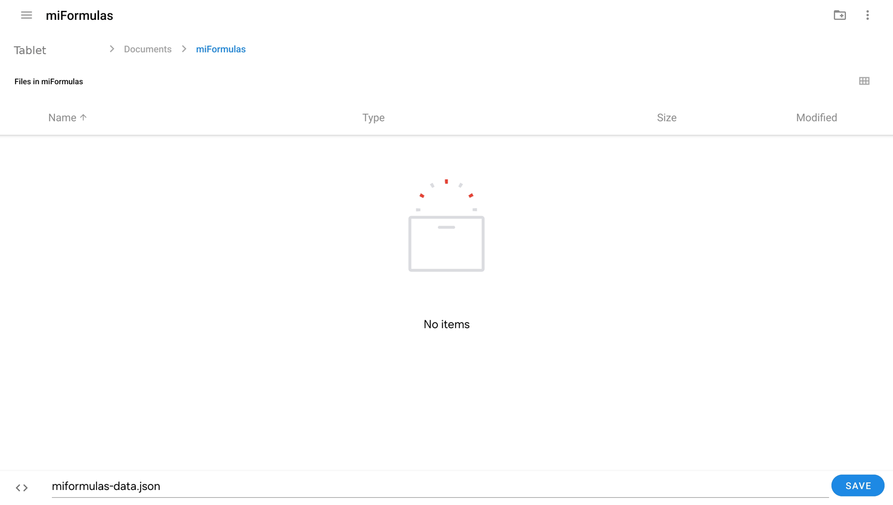

At every start the app shows **Reopen** and Chrome asks whether the site may edit the file. Tap **Allow** and you are in your data. Chrome on Android grants that permission only until you close the site's tabs, so unlike on a computer the question comes back every time. A server of your own (section 7) avoids it, and gives you the same data on your phone and your computer.

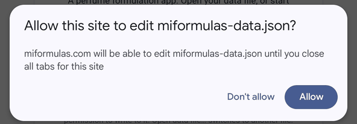

Firefox and Samsung Internet on Android have not been tried.

## 6. Coming from Formulair

A word about Formulair first. I discovered perfumery together with Formulair, Sam Macer's formulation app for the Mac, and for an app built before the AI era it was remarkably complete: materials with their dilutions, formulas with notes and colour marks, costs, IFRA limits, stock. Only two things drove me to build miFormulas: the limits that come with a Mac-only app, and the possibilities that AI assistants now offer around a formulation notebook. The importer below is a bridge and a homage: everything you built in Formulair comes along.

The importer at https://miformulas.com/formulair-import.html reads the Formulair database entirely in your browser and adds your formulas and materials to miFormulas, whatever it uses to save (browser storage, a data file or a server). Nothing leaves your computer.

1. The database is the file `DataModel.sqlite` in Formulair's own folder, which the Finder keeps hidden; the steps below get a complete copy of it onto your Desktop.
2. In Formulair choose **File**, **Close**; Formulair writes its latest changes into the database file and quits by itself (a plain Cmd+Q does not always write them). In the Finder choose **Go**, **Go to Folder…**, paste `~/Library/Containers/co.uk.lux-terra.Formulair/Data/Library/Application Support/Formulair/` and copy `DataModel.sqlite` to the Desktop. A quick check: `DataModel.sqlite` should now carry today's date, and `DataModel.sqlite-wal` next to it should be small (kilobytes, not megabytes). If the -wal file is large, your latest changes are still in it: copy all three files (`DataModel.sqlite`, `-wal` and `-shm`) to a folder `Formulair` on the Desktop and fold them in with one line in Terminal, `sqlite3 ~/Desktop/Formulair/DataModel.sqlite "PRAGMA wal_checkpoint(TRUNCATE);"`, then use the `DataModel.sqlite` from that folder.
    
    
    
    

3. Open the importer: click **Import from Formulair** on the start screen or in the Import & export box on the Welcome page, or go to https://miformulas.com/formulair-import.html. Drop `DataModel.sqlite` on it and wait a moment; the file can be large because Formulair keeps a long sync history inside it. If you point the browser straight at Formulair's own folder instead of at the copy on your Desktop, macOS asks whether the browser may access data from other apps: that other app is Formulair, so click **Allow**.
    
    

4. Click **Add to miFormulas**. The app opens and adds everything to what is already there: materials with the same name are matched (their Formulair dilutions come along and empty fields are filled in), the others are added, and every Formulair formula arrives as a frozen formula. A message tells you the counts; one Undo takes the whole import back, and a formula imported before is not imported twice. Prefer a file? **Download miformulas-data.json** gives the same data as a file, for a server or your own tools. **Back to miFormulas** at the top returns to the app without importing.

Every Formulair formula becomes a miFormulas formula with one frozen version, keeping its notes, date, category and colour marks per line, and every material comes with its dilutions, CAS (if you wrote other names next to the CAS number in Formulair, the number stays and those names become alternative names), supplier, cost, IFRA limit, pyramid level, stock and description; categories keep their colours. Nothing is converted or renamed, and amounts are in grams.

Formulair is flat: "Aura v04" and "Aura v05" are two separate formulas there, and they stay separate here. Grouping them into one formula with versions v4, v5 and v6 is a decision for you, made afterwards in the app with **Move into…** (section 10): open "Aura v04", the one with the lowest number, and click Move into…: the app suggests **this formula** as the target and lists "Aura v05", "Aura v05 20%" and "Aura v06" under Move together, ticked. Click Move: they become the next versions of "Aura v04" in one go, in the order of the numbers in their names; then rename "Aura v04" to "Aura" and give the 20 % one its label with the **pencil**. Opening another one first works too: the app then suggests the lowest-numbered formula as the target. A formula that already holds several versions can no longer be moved itself, so stragglers are moved from their own page. The app never groups by itself, because every perfumer names things differently. For a large collection, `docs/ai-prompts.md` has a prompt that lets an AI assistant propose the grouping from the list of names, for you to review before you start.

The same conversion exists as a command-line script, `tools/formulair-naar-json.py`, for those who prefer a terminal.

## 7. A server setup for cross-device use

A data file keeps your work on one computer. The moment you want the same formulas on a second computer and on your phone, something has to hold them in one place that all three can reach. That place is what the app calls a **server**: it loads from it at the start, saves to it after every change, and checks before each save that no other device wrote in the meantime.

It matters most for a phone. No browser on an iPhone or iPad can write to a data file, and Chrome on Android asks permission for the file at every start (section 5). With a server, both simply open the app and are in the same data.

There are two ways there. **A** costs nothing and needs no server, no domain and nothing installed; it is the way for most people. **B** is for those who already have a NAS or a hosting account with PHP.

### A. A free Cloudflare Worker

Cloudflare runs small pieces of code, called Workers, and offers storage for files, called R2. The miFormulas endpoint is one file of about 150 lines that you paste into their editor; the storage holds your data file and the daily snapshots. Both have a free tier without a time limit, and miFormulas stays far inside it: R2 gives 10 GB of storage with a million writes and ten million reads a month, and a Worker 100,000 requests a day, while a data file of a few megabytes and a few hundred saves a day is what heavy use looks like. Enabling R2 may ask for a payment method; within the free tier nothing is charged.

What you end up with is an address like `https://miformulas-data.yourname.workers.dev`, a token you choose yourself, and your data in a bucket only you can read. It is https from the start, so **Install as an app** (section 5) works on every device.

The screens below are how the Cloudflare dashboard looked in September 2026. Cloudflare moves its buttons from time to time; when a name does not match, their own documentation at https://developers.cloudflare.com/workers/ is the place to look.

**Before you start.** Have your data ready: click **Backup** in the app and keep that `.json` file at hand. And choose a token now, a long random string of some twenty characters. You will paste it into two places and nowhere else.

1. **Make an account** at https://dash.cloudflare.com. The free account is enough, and you do not need a domain.

    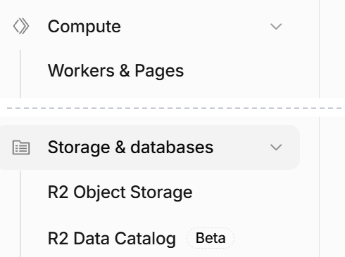

2. **Create the Worker.** In the sidebar choose **Compute** and then **Workers & Pages**, press **Create application**, and choose **Start with Hello World!**. Give it a name you will recognise, `miformulas-data` for instance; that name becomes part of the address. Deploy it once as it is.

    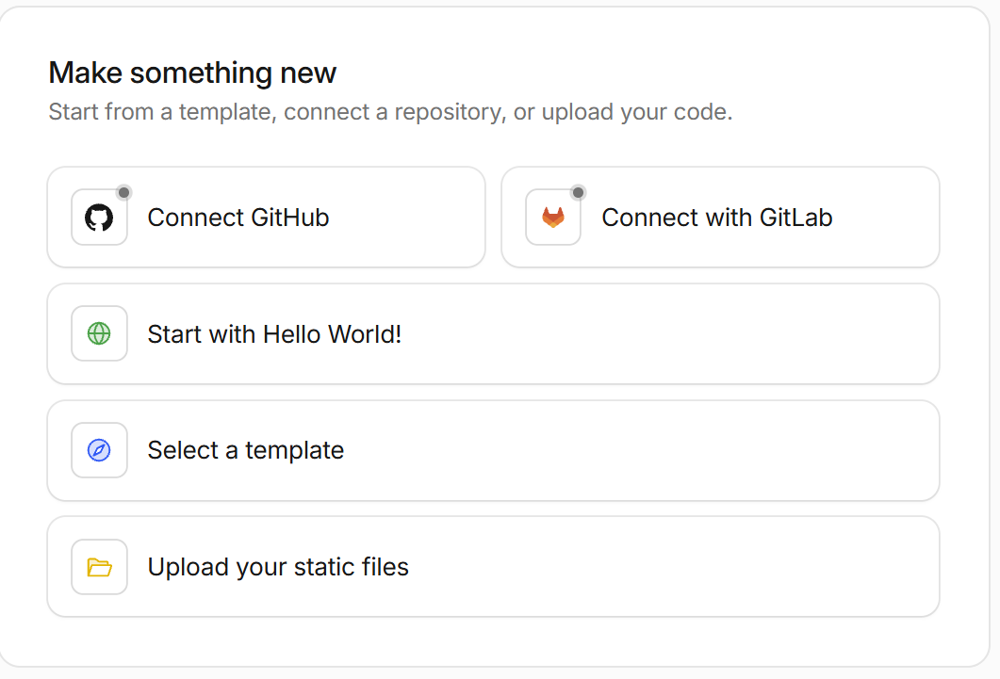

3. **Paste the code.** Open the Worker's editor, select everything that is in it, and paste `server/worker.js` from the miFormulas repository over it (https://github.com/miformulas/miformulas/blob/main/server/worker.js, the **Copy raw file** button). Deploy again.

    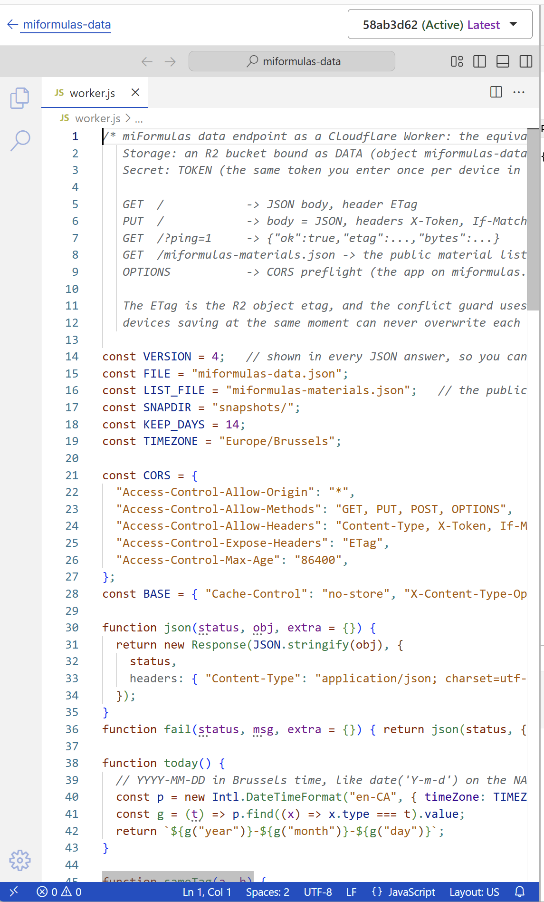

4. **Create the storage.** In the sidebar choose **Storage & databases** and then **R2 Object Storage**, press **Create bucket**, and name it, `miformulas-data` for instance. This is where your data file will live.

    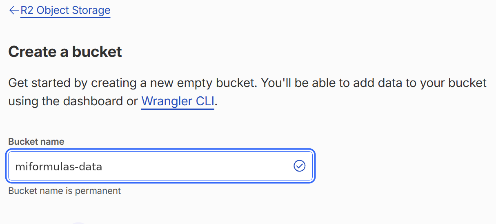

5. **Connect the two.** Back on the Worker's own page, not in the code editor, open its **Bindings** tab and press **Add binding +**, then choose **R2 bucket**. The variable name must be exactly `DATA`, and the bucket is the one you just made. That name is what the code looks for; finish with **Deploy**.

    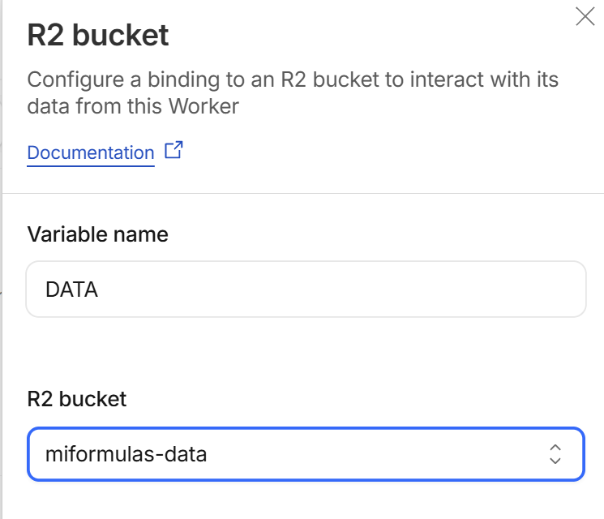

6. **Set the token.** On the same Worker, open the **Settings** tab and find **Runtime variables and secrets**. Press **Add variable**, put exactly `TOKEN` in **Key** and your own token in **Value**, tick **Secret**, and confirm with **Add 1 variable and deploy**. Tick that box: a secret is not shown again afterwards, while a plain variable stays readable to anyone who opens the dashboard.

    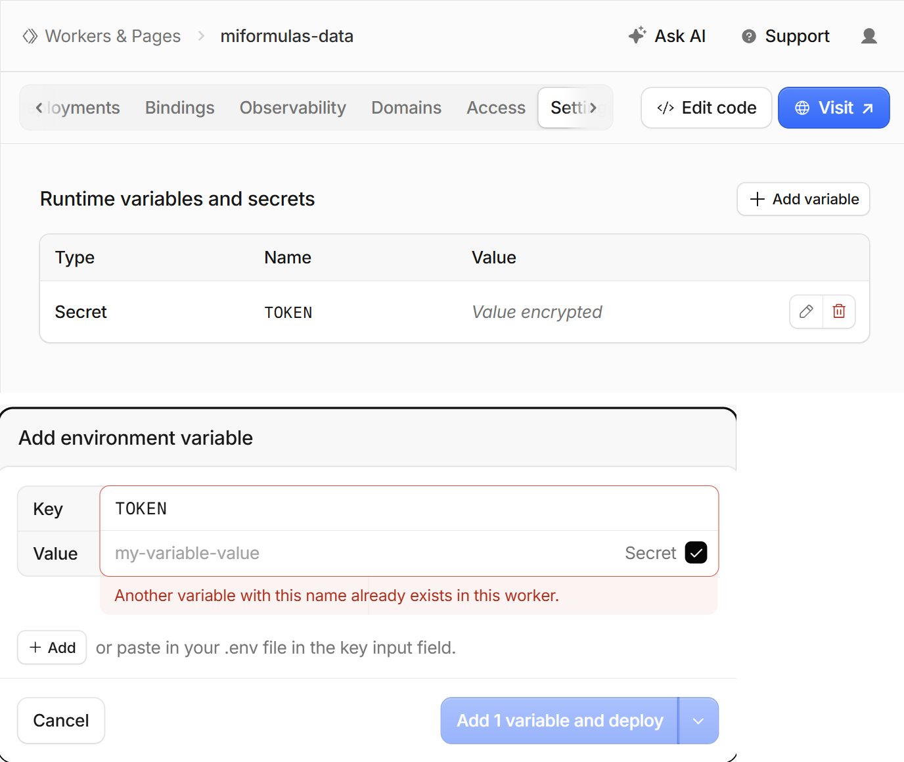

7. **Note the address.** The Worker's **Domains** tab shows it under **Worker URL**, ending in `.workers.dev`. That is the endpoint the app needs.

    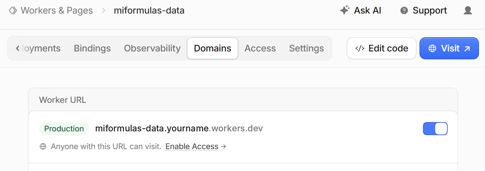

8. **Check it before you go to the app.** Open that address in a browser. It should answer `{"error":"invalid token","worker":5}`. That is good news: the Worker is alive, it found its bucket and its token, and it refused you because a browser sends no token. The number is the version of the code you pasted, so it also tells you whether a newer `worker.js` really took. Any other answer names the step that went wrong. `TOKEN secret is not set on the Worker` is step 6, `R2 bucket binding DATA is missing on the Worker` is step 5, and a Cloudflare error page instead of JSON means the code of step 3 did not deploy.

    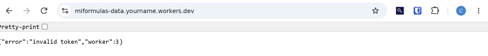

9. **Connect the app.** Open https://miformulas.com, click **Settings** (⚙), fill in the address as **Server endpoint** and your token as **Access token**, and click Apply. The app reloads, and because the bucket is still empty the start screen stays: it says the server has no data file yet, and offers three ways on. **Start with the starter set** and **Start empty** create one there; **Open data file…**, next to **Connect to server**, reads the Backup you put ready and the app saves that to the server. From then on the header says "Connected to server".

    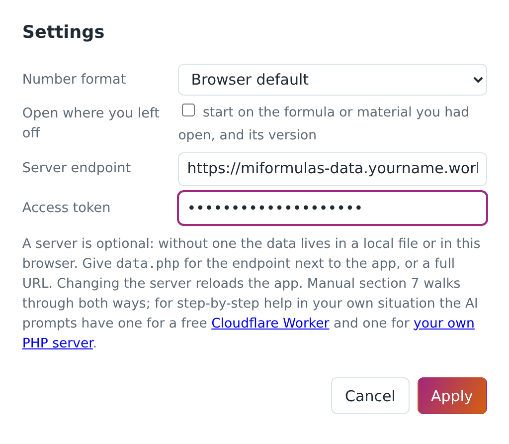

On your other computer and on your phone, only step 9: the same address, the same token. Install the app there (section 5) and it opens straight into your data.

**Is my data really in there?** The Worker reports on itself as well, at the same address with `?ping=1`. A browser cannot send the token, so this one asks for a command line (`curl.exe` on Windows, `curl` on macOS and Linux):

    curl -H "X-Token: your-token" "https://miformulas-data.yourname.workers.dev/?ping=1"

The answer is `{"ok":true,"worker":3,"etag":…,"bytes":…}`, where `bytes` is the size of the data file in the bucket, to hold against the size of your last Backup. The R2 page in the dashboard shows the same file with its size, next to the folder `snapshots/`.

**Keeping it.** There is nothing to maintain. The app itself comes from miformulas.com and updates itself, and the Worker only holds your data; a newer `worker.js` is worth pasting in only when the release notes say so, and your data stays where it is because the code and the storage are separate things.

### B. Your own web server with PHP

You need a web server with PHP (8.x) that you can put files on: a Synology or QNAP NAS with its web station, a Raspberry Pi, a small hosting account.

1. Put `index.html` and `server/data.php` in a folder on the server, and create a folder `data` next to them that the web server is allowed to write to. On a NAS this means giving the web server's user (often `http`) read and write rights on that folder; the endpoint tells you in plain words when it cannot write.

    That folder sits in the web root, and a web server serves what is in its web root: someone who tries the address `…/data/miformulas-data.json` gets your whole file, token or no token, because the token only guards `data.php`. On Apache the endpoint writes an `.htaccess` in that folder that denies it, and the repository carries the same file. Other web servers (nginx, Caddy, the web station of some NAS models) do not read `.htaccess`, so there the safe answer is a folder the web has no address for: open `data.php` and set `$DATA_DIR` to a path outside the web root, `dirname(__DIR__) . '/miformulas-data'` for instance. Step 5 tells you which of the two you have.
2. Open `data.php` in a text editor and replace `change-me-to-a-long-random-token` by a long random string of your own. This token is the password to your data.
3. Put your `miformulas-data.json` in the `data` folder (a Backup from the app, or the file from the Formulair importer), or let the app create it.
4. Open the server's address in a browser. The app detects `data.php` next to itself, asks for the token once, and from then on says "Connected to server". On other devices, open the same address and give the same token; or open Settings and fill in the server endpoint and token by hand, which also works for a `data.php` at another address than the app: the endpoint answers the browser's preflight and allows any origin, so the app and your data may live on two different addresses. Those two fields are there when you open the app from a web address, which is what a server is; the copy you downloaded to your own disk does not show them.
5. **Check it when something is off.** Open the address of `data.php` itself in a browser: `{"error":"invalid token"}` is the good answer, because a browser sends no token, and it already tells you that PHP runs and that the file is reachable. With the token it reports on itself. A browser cannot send a header, so this one asks for a command line (`curl.exe` on Windows, `curl` on macOS and Linux):

        curl -H "X-Token: your-token" "https://your-server/data.php?ping=1"

    The answer is `{"ok":true,"etag":…,"bytes":…,"dataDirInWebRoot":…,"htaccess":…}`. `bytes` is the size of the data file on the server, which you can hold against the size of your last Backup; `"dataDirInWebRoot":true` with `"htaccess":false` is the case that step 1 is about. The call writes the `.htaccess` when it is missing and Apache is what you run.

Reaching the server from outside your home is a matter of your network. A VPN such as Tailscale is the simple and safe way, and it can also give the server an https address, which the "Install as an app" options need. Do not put `data.php` on the open internet without https: the token travels in a header. None of this applies to way A, which is on the internet with https from the start.

To update the app on your own server, copy the new `index.html` over the old one; the data stays.

### What the endpoint does, on either way

It returns the data with an ETag and accepts a save only when the ETag still matches, so that two devices cannot overwrite each other as long as the server passes that ETag through (the app then shows a conflict warning: make a Backup, reload and redo the change; the very first save, when there is no data file yet, has nothing to match and is simply written), and it keeps a snapshot of the previous state on the first save of each day, fourteen days long: in `data/snapshots` on a PHP server, under `snapshots/` in the bucket on Cloudflare. A server that hides the ETag from the browser (a proxy that strips the header, or CORS without `Access-Control-Expose-Headers`) makes the app say so once: saving still works, but that protection is off until it is fixed. Both endpoints send that header themselves, together with the rest of the CORS block and an answer to the browser's preflight, so the app and the endpoint may sit at two different addresses; what can still take the header away is a proxy or a CDN in front of the server. A save is answered with the new ETag and with the number of bytes that were stored, the same figure `?ping=1` reports, so what is on the server can always be held against the size of your last Backup. Restoring a snapshot is copying that file over `miformulas-data.json`. When the app starts without loading anything from the server, because it was unreachable or held no data file yet, the first save looks once more before it writes: if a data file has arrived in the meantime, nothing is sent and the app says so, so that a fresh start here cannot land on top of work that was saved elsewhere.

If you would like step-by-step instructions for your own situation, `docs/ai-prompts.md` has a prompt for each way. Keep in mind that an assistant knows the miFormulas side of it well and the Cloudflare dashboard badly: for way A the screens in this section are the authority, not what an assistant remembers.

## 8. The screen

The **header** holds two groups. On the left what the content is: the list toggle (☰, also Ctrl+B), **Home**, **+ New formula…** and **+ New material…**; the installed app adds a back and a forward arrow there, because an app window has no toolbar of its own (section 21). On the right what the file is: the save state, **Undo** and **Redo** (arrows on a narrow window), **Save** (saving is automatic; this forces it now, also Ctrl+S), **Backup**, **Import/Export** (⇅, section 20), and then the four buttons you need rarely: reload (the circular arrow, for after an update), the theme (◐ auto, ● dark, ○ light; the icon is the setting and the tooltip spells it out), **Help** (?, this manual inside the app, without the screenshots) and Settings (⚙). Below about 1160 pixels the right group moves to a second row as a whole, so nothing ever runs off the edge.

The **list panel** on the left has three tabs. **Formulas** and **Materials** group their items by category with a coloured dot; the counter after each formula tells how many versions it holds. **To order** is the shopping list. The search box filters the list: formulas by name; materials by name, alternative names, CAS number and supplier, and from three characters also by the text in their description (those hits are marked with ✎). Accents and ligatures do not matter: "haiti" finds Vetiver Haïti and "coeur" finds Patchouli cœur, and the same folding decides whether an import lands on a material you already have. Each tab keeps its own term, so the name of a material does not stay behind in the formula list when you switch. Typing "starter" lists the starter set. When nothing in your inventory matches and a materials library is loaded (section 20), the panel says "Not in your inventory" and shows what the library does know, with a **+ Add** button that puts the material in your inventory with its facts.

The **page** on the right shows the selected formula or material, the order list, or the Welcome page.

On a phone the list and the page take turns; the app is read-only there unless it can save (server, browser storage or a writable file), so that a tap cannot lose anything. Read-only takes away what would change something, in the windows as well: a materials library cannot be imported or fetched there, and **Import from Formulair…** is not offered, because there would be nowhere to save the result. Printing, the Excel export, **Share this version** and the dosage field of the IFRA check stay where they are, because none of them touches your data. The header leaves out ☰, **+ New formula…**, **+ New material…**, **Redo** and **Save** on a phone: the list is the main screen there, creating is desktop work, and saving happens by itself. The formula table drops the columns **Abs %** and **Cost** there, to leave room for the dilution picker; swipe the table sideways to see the rest. The order list drops **Note**, **Price €**, **Product URL** and **Added**, so that the material, the amount and the three buttons fit on the screen without swiping: in a shop you work from that list, you do not fill it in.

## 9. Materials

The **Materials** tab is your inventory: the materials you own or have on order. A **materials library** is something else, a reference file of facts that you import (section 20); it never changes what you own.

A material is anything you weigh: a raw material, a natural, a base, a solvent, one of your own predilutions. Its page holds the name, CAS number, alternative names (trade or common names such as Ambroxan for Ambroxide, separated by semicolons; they count in the search box and when an import matches its lines), category (the categories that come with the starter set and with a Formulair import carry a colour, used for the dots and the pyramid; beside the picker sits a small colour square that sets the colour of the chosen category, so a category you make yourself does not have to stay grey, and **+ New category** makes one without leaving the page), supplier, the amount purchased (free text, so an imported “2 × 50 ml” stays exactly as it was), cost per gram (of the pure material: for a dilution you bought, divide the price by its percentage), IFRA limit, whether it is a solvent, where it is stored (cupboard, fridge, freezer), and its position in the olfactive pyramid (Top, Top-heart, Heart, Heart-base, Base, or ?). Below that come the dilutions, the optional stock ledger (which also holds the date you bought it and the density in g/ml that section 19 uses to read a volume as a weight), a free description, and the list of every formula the material appears in; click a name there to jump to it. The heading counts them all and the list shows the first sixty, with "and N more" underneath when there are more. A material always keeps at least one dilution, so the last one cannot be deleted: add the other one first.

**Look it up.** Next to the CAS number and category sit three small links that open in a new tab, so that checking a material is one click instead of copying its name around: **TGSC** and **Olfactorian** search those sites for the CAS number (only the number itself, whatever else the field holds; or the name, if there is no CAS) through DuckDuckGo, and **IFRA** opens the IFRA Standards library with the CAS number already on your clipboard, because that library has no address per material: paste it in the search box there. The app copies nothing from those sites into your inventory; what you enter is up to you.

**Dilutions.** A material offers only the dilutions you actually own. If you have Iso E Super at 100 % and at 10 % in ethanol, add both; if you only ever bought a 10 % dilution of a costly absolute, add only 10 %. Add one with **Add dilution** (a percentage and an optional note) and make it the base with **Set base**; **✕** removes one, and the highest remaining dilution becomes the base if you remove that one. One of them is the **base** dilution, the concentration that new formula lines start with; any dilution can be the base, and 100 % is not assumed. Deleting a dilution that formulas use is allowed: those lines keep their value, it only disappears from the pick list.

**Solvent.** Tick this for ethanol, DPG, IPM, TEC and the like. Solvent lines carry no aromatic content: they do not count in the relative percentages and they are what the dilution tools exchange against.

**IFRA limit.** Enter the limit in percent of the finished product for Category 4 (fine fragrance), taken from the standards library on ifrafragrance.org. Three special values: **99** means checked, no restriction; **0** means prohibited in this category; empty means not yet checked, and so is any figure below zero. The IFRA panel of a formula uses these figures (section 18).

**Storage.** A material stored in the fridge shows a ❄ next to formula lines that use it at its base concentration, also on the printed weighing sheet, so you know which bottles to fetch first.

**To order.** A material you do not have yet, whether you added it from the order list or it came out of an import, carries the label "to order" and a 🛒 in the list until it is delivered.

Materials come from **+ New material…** in the header (name, category and base dilution; the rest is filled in on the page), from the order list, from an import, or from the predilution tool. With a materials library loaded (section 20) the name field suggests the names in it, by name and by alternative name, and a match brings its facts along: CAS, category, pyramid level, IFRA limit, the alternative names, and a few lines at the top of the description: the odour words, then the impact, the substantivity and the concentration it is typically used at. Everything stays editable, and one Undo takes the whole material back. The search box in Materials also reaches the library: under your own results it lists what the library knows and you do not have ("Also in the materials library:", or "Not in your inventory. In the materials library:" when you have none of them), eight at a time with "and N more; narrow the search" underneath, each with a **+ Add**. **Browse the library…**, in the + New material window, opens the whole library with a search field and a tick box per material: useful when you start from nothing and want ten materials at once. Shift-click ticks a range, as in the formula table. What you already have is greyed out and cannot be ticked, everything arrives at 100 % base dilution, and the whole batch is a single Undo step. **Delete material** refuses as long as any version uses the material, an older or a frozen one included, and names the formulas; the list of them stands on the page as well. Removing the lines from the latest version is the way out, and for a version that cannot be edited the refusal says so and points at **Delete version**, or at leaving the material where it is, since one you do not use costs you nothing. When nothing uses it any more, deleting asks for confirmation and says how many order-list entries go with it.

Two materials cannot carry the same name, and the app watches the alternative names in both directions. Type a name that one of your materials already carries as an alternative name and it says so before making a second material. Rename a material to a name that another one carries as an alternative name and it asks as well, with the consequence: from then on an import that uses that name lands on the renamed material instead of the other one.

**Alternative names may be shared, and often have to be.** Four ylangs come from the same plant, and two isomers with a profile of their own sit under one chemical name, so a botanical or common name can belong to several of your materials at once; the library that comes with miFormulas has twenty-one such names. Your own names stay unique and always win, but a shared alternative name no longer says which jar you mean. The app therefore does not choose one behind your back: **Add line**, **⇄ Replace** and **Delivered…** ask which of them you mean, the import page shows the match it would make together with the other materials that answer to the same name, and the alternative names field tells you when a name you type is already carried by another material, so that you know it will be asked about later. The suggestion lists behind those boxes carry one line per material with its alternative names beside it, and Chrome and Edge match what you type against those names too, so a botanical name four of your materials share brings up those four and picking one puts its own name in the box.

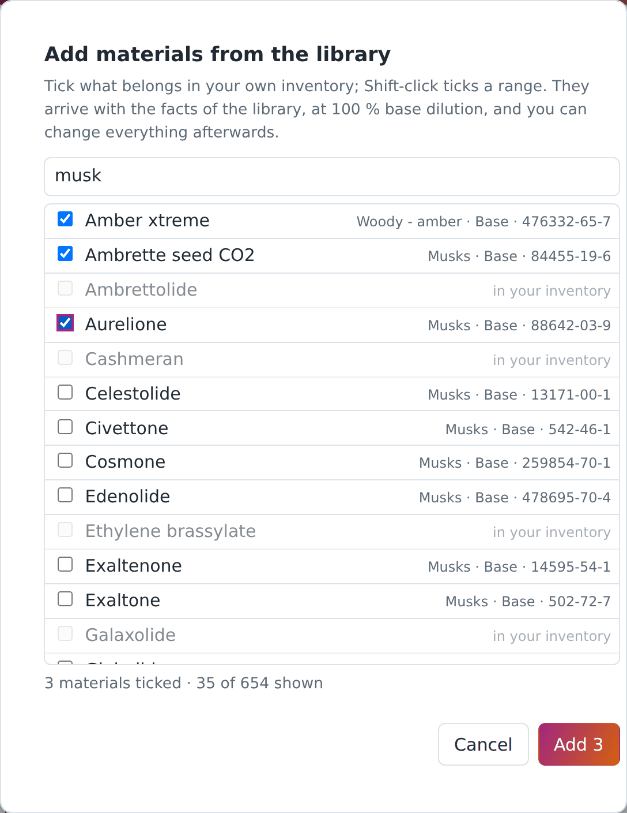

Filling in CAS numbers, IFRA limits, pyramid levels and descriptions for many materials is tedious; `docs/ai-prompts.md` has a prompt that lets an AI assistant propose them from the **Export all materials (Excel)** export, for you to check and enter.

What some apps ship as a built-in materials database, miFormulas keeps as a file you import: a **materials library** (section 20). With one loaded, a new material arrives with its CAS number, category, pyramid level, IFRA limit, alternative names and a few lines of odour facts already in place, all of it editable. Those are facts, and facts can be shared freely; the odour descriptions on supplier sites are somebody's writing and are not in it. The library published by miFormulas holds several hundred materials under CC BY 4.0, and **Get the latest library** in Settings fetches the current one. It is not inside the app, the repository or the ZIP: it changes more often than the app does, so the app asks for it when you do.

## 10. Formulas and versions

A **formula** is a named recipe in a category. Its history is a row of **versions**: v1, v2, v3 and so on, each with a date, an optional label, notes and its own lines. Only the latest version can be edited; every earlier version is a frozen record of what you did, kept exactly as it was. When you want to change something, create a new version (**+ New version** copies the version you are looking at) and edit that. Deleting a version is possible, deleting the past is not: a new version never rewrites an old one.

Another presentation of the same recipe is a version too: the formula at 20 % instead of 15 %, with the costly material taken from the 10 % dilution instead of the pure one (make a new version and change the dilutions with **Preserve rel % and exchange solvent**, section 13), or made up as a 44 g batch instead of 100 g (Batch scaling, section 14). Give such a version a label with the **pencil** ("20%", "soap", "44gr") so the list tells them apart. Earlier builds had a separate notion of "variations" for this; it went in build 260915b, because versions do the same with less to learn. A data file that still holds variations loads with a warning: they are left in the file untouched, but not shown.

Formulas imported from Formulair are frozen too (section 6): you read them, compare them and copy them, but to work on one you make a new version.

Frozen means the amounts are fixed, not that the entry is untouchable. You can still name a version with the **pencil**, write notes, add trial-log entries, set colour marks, arrange the bench view and use **Mark as prepared** on a frozen version: those are your annotations about it, not the recipe itself. In the version list a **🔒** marks a version that came in from an import, and the name it carried there is shown after the version number as a reference; the window behind the **pencil** has a tick box **show the import reference** to hide that name in the list once the grouping is done. It only hides it: the reference stays in the file, so a second Formulair import still recognises the formula.

**Move into…** appears on any formula that still has one version, whatever it came from: a formula from the Formulair import, one you brought in with Import formula…, or one you typed yourself. It makes that formula a new version of another formula and removes it from the list. Lines, notes, date, colour marks and trial log come along; an import keeps its import name as a reference and stays frozen, a formula of your own arrives as an ordinary version that keeps its name as the version label, so nothing of it is lost from the list. Everything is one Undo step. This is how you group the flat Formulair import (section 6). When other single-version formulas share the name, the dialog lists them under **Move together**: those whose name carries a version number ("Aura v04", "Aura v05 20%") come ticked and go into the target in the same go, as versions numbered by that number and then by name. Untick what should stay, and add any other single-version formula with the search field below the list. It does not matter which of them you open: the dialog suggests the one with the lowest number as the target, and if that is the formula you opened, it offers **this formula** and the others move into it. You can always choose another target; a formula that has already received versions cannot be moved itself any more.

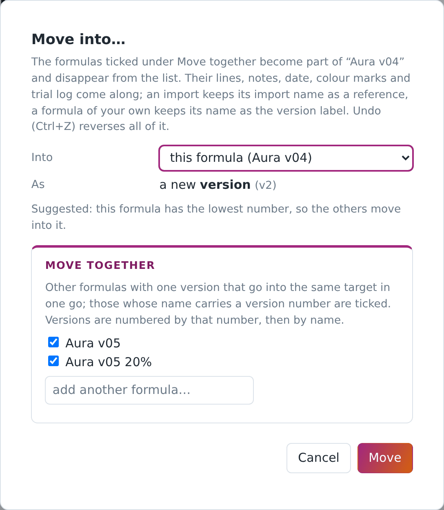

**Copy to new formula…** takes the version you are looking at as v1 of a new formula, with its lines, bench arrangement, notes and trial log; the notes open with a line saying which formula and version it was copied from. **Rename…** and **Change category…** do what they say; categories are shared between formulas and get a colour dot, which the colour square beside the category picker sets. A new formula starts in **Uncategorised** unless you pick another category, whatever you happened to be looking at.

**Delete version** asks first and names the formula and the version it is about. When it is the only version it says so: the formula then stays in your list without lines, and **Delete formula** is what removes the formula itself. Undo (Ctrl+Z) brings a deleted version back during the session.

## 11. Editing a formula

A formula line is a material, a dilution and a weight in grams. To add one, type the material's name in the **Add material…** box under the table (the list suggests as you type) and click **Add line**; the line starts at the material's base dilution with weight 0. Type the weight, choose another dilution from the list if you have one (a trace dilution keeps the decimals it needs, so 0,001 % and 0,01 % do not both read as 0 %), or pick **custom…** for a percentage you do not stock (the app then warns with ⚠ that this dilution is not in your list, see section 13). Remove a line with ✕, and swap the material on a line for another with **⇄**: the dilution and the weight are carried over, so a line you weighed stays weighed. Both the box and ⇄ accept an alternative name of a material you own ("Ambroxan" finds your "Ambroxide"), so you do not create the same material twice, and the suggestion list shows each material with its alternative names beside it, so typing one of those names brings up the materials that carry it. When nothing of yours carries the name you typed, the app does not go straight to creating one: it runs the same search as the list panel in section 8 (name, alternative names, CAS number, supplier, and the description) and shows what that finds, with what it matched on, so that you can pick the material you meant. **None of these** goes on to create it. Adding a material the version already holds at that same dilution asks first, and says what a second line would mean: the weighing sheet lists it twice, while Compare adds the two together. Say yes and an amber line keeps warning about those **duplicate lines**, in the table and in the bench view alike, because it is nearly always a slip. Weights can be typed one after another without the mouse: **Tab** confirms the weight and moves to the next one, Shift+Tab to the previous, and Enter keeps you in the field you are in.

If you add a material that is not in your inventory, the app offers to create it as a "to order" material: it goes on the order list, and the line is marked until the material is delivered. With a materials library loaded (section 20) it arrives with the facts the library holds, exactly as **+ New material…** does; the same goes for a formula import and for **Delivered…** on the order list.

The table can be ordered by original entry, by category or by pyramid level (top to base), or by clicking a column heading; the order is also used for the printed sheets. The little icon before each material name shows its pyramid level in the colour of its category.

Below the table sit **Batch scaling** (section 14, on the editable version only), **Notes**, the **Trial log** (section 15), the **Categories** panel and the **IFRA check** (section 18), and **Mark as prepared** for the stock ledger (section 19).

## 12. Percentages and the perfumery arithmetic

The table shows two percentages per line, and they follow perfumery practice rather than plain weight shares.

The **content** of a line is its weight corrected for the dilution: 2 g of a 10 % dilution is 0.2 g of material.

**Rel %** is the content of a line divided by the total content of all non-solvent lines. The column adds up to 100; solvent lines show a dash, because they carry no material. This is the composition of the concentrate, independent of how much ethanol is around it.

**Abs %** is the content of a line divided by the total weight of the formula, solvents included. The total of this column is the concentration of the mix: a formula with 15 % abs in total is a 15 % concentrate. Solvent lines show their share of the weight here.

The **cost** of a line is weight × cost per gram × dilution, and the total cost is what the batch cost you in materials. The column appears as soon as one material in your inventory carries a price, and stays away while none of them does, because a column of zeros says nothing.

These rules are what makes the dilution tools work: changing a dilution while preserving rel % keeps the smell the same; the abs % and the total weight then tell you what happened to the strength and the batch size.

## 13. Changing dilutions

Change the dilution of a line by choosing another value in its dilution list. Because a different dilution means a different weight for the same amount of material, the app asks how to proceed:

- **Preserve rel % and exchange solvent.** The weight of the line changes so that its content stays the same, and the difference is taken from or given back to the solvent line (ethanol first, otherwise the first solvent). The total weight and the concentration do not change: this is the same formula, made from another bottle. Not available when there is no solvent line, or when the solvent line does not hold enough to give back.
- **Preserve rel % only.** The weight of the line changes, nothing else; the total weight and the abs % shift.
- **Preserve weight.** The grams stay as they are, so the material content and the rel % change. Use this when the weighing is the fact and the dilution was wrong.

The same question comes up when you replace a material by another one whose dilutions differ.

**Lower** and **Higher** in the tick bar shift all ticked lines to the next lower or higher dilution that the material offers, preserving rel % and exchanging the solvent in one go (so the formula needs a solvent line); lines already at their lowest or highest are skipped and reported, and so is a ticked solvent line, because the solvent is what takes up the difference.

Lines with a dilution you do not stock are marked ⚠, typically after an import. They compute correctly; when you next make a version, convert them to a dilution you have with "preserve rel % and exchange solvent".

## 14. Batch scaling and predilutions

**Batch scaling** sits under the table. **Apply factor** multiplies every weight (2.5 turns a 40 g trial into 100 g). **Target total** rescales the whole formula to a given weight. **Set EtOH for target abs %** changes only the ethanol line so that the concentrate reaches the percentage you type, adding an ethanol line if there is none; the hint shows the maximum reachable with no ethanol at all. Batch scaling is there on the editable version only, and the printed weighing sheet always shows the weights as they are stored. To weigh another quantity, make a new version and scale that one: the batch on your bench then carries a version number that points back into the app, which a rescaled print would not.

**Create predilution…** bundles ticked lines into a separate, weighable mix. Perfumers do this for the trace materials: instead of weighing 4 mg of five things, you weigh 4 g of each once into a premix and dose 0.4 g of that. The app takes the ticked lines as displayed, lets you name the predilution and choose a batch factor (the preview shows the mix weight, its aromatic strength and the smallest line you will have to weigh, in grams like every other weight in the app, so you can see at a glance which factor makes it weighable), then creates three things at once: a frozen predilution formula in the category "Predilutions", a material in the category "Predils" with the aromatic concentration as its dilution and the cost per gram computed, and a new version of your formula in which the ticked lines are replaced by one line of the predilution at the same content. Everything is one Undo step.

## 15. Colour marks, notes and the trial log

Tick lines with the checkboxes on the left (Shift-click ticks a range) and use the **tick bar**: mark them red, green, blue or yellow, unmark them, or clear every mark in the version at once, which asks first and says how many go. Marks are per version, and they carry over into new versions and copies, and into a formula you move into another with **Move into…**. They stay inside the app: a shared file, the Excel exports and **Export all my formulas** carry the recipe, not your marks, because a colour means something to you and nothing to the person you send it to. Use them as you like: what changed, what to smell for, what to check.

**Notes** is a free text per version, shown on the formula sheet. The **Trial log** is a dated list of short entries ("day 3, macerated, top too sharp") that also prints on the formula sheet.

## 16. Bench view and printing

The arrangement belongs to the version and hangs on the lines themselves, so changing a dilution or deleting one of two identical lines leaves the other where you put it. **Bench view** (the button next to the formula name, which reads **Table view** while the bench is open, with **Close bench** underneath it) is something you will not find in other formulation apps. It is inspired by the way Ryan Parfums builds his batches in his YouTube videos: start with the core materials, smell, then add the next group of materials step by step. Bench view turns the formula table into that kind of worksheet. The lines start in the **Unsorted** column on the left; drag them into named groups on the right, or tick several lines and choose **Move ticked to…**. The Unsorted column keeps every sort order of the table (original, A to Z, dilution, weight, rel %, category, pyramid), so sorting by category, ticking all the rose materials and moving them into one group takes a few clicks. Five groups are there to start with; **+ Add group** makes as many more as your batch needs, and you can rename, reorder (the ⠿ handle, or ↑ and ↓) and delete groups as you like; **⇤** empties one back into Unsorted without deleting it. Each group shows its line count, weight, rel % and aromatic strength, so you see what each step adds to the batch. The arrangement is saved with the version. The groups stand beside the Unsorted column on a wide screen and below it on a narrower one, so the group buttons are always within reach. **Print bench sheet** prints the groups with a checkbox per line, in the order you will weigh them.

From the table view, four buttons under the lines, in this order: **Print full formula**, **Excel export**, **Share this version** and **Print weighing sheet**. The line under them says what each is for. The two prints are not the same sheet: the full formula is the record of the version, the weighing sheet is what you work from at the bench. **Ctrl+P** or File › Print without one of these buttons prints that same weighing sheet of the version you are looking at, in bench view as well; outside a formula it prints a line saying so, so what goes to the printer is never a sheet left over from earlier.

- **Print weighing sheet** prints the lines in the current order with a checkbox, the pyramid icon, the dilution, the grams to weigh and rel %, exactly as the version holds them; it never rescales, so what you weigh always matches a version number (section 14). Fridge materials carry the ❄, and a material you do not own yet reads "(to order)", so you notice at the bench and not at the cupboard.
- **Print full formula** prints the complete entry with weights, both percentages, the total, and the notes and the trial log underneath; the cost per line is there once a material of yours carries a price, exactly as the column on the screen appears only then. This is the record of the version, the one to keep on paper or as a PDF.
- **Excel export** downloads the entry as a CSV file, which a spreadsheet opens directly. Use this for a colleague who does not use miFormulas: they can read it, sort it and work in it. A line whose material you have since deleted has no name to write; the app says how many there are and asks before it leaves them out.
- **Share this version** downloads the entry as a miformulas-import file, the same format described in section 20. Send it to someone who does use miFormulas and they import it in one action, instead of typing your formula line by line. It holds the material names with their dilution and weight, the CAS numbers, a mark on the lines that are solvent in your inventory, the category, the label of this version and its notes, and nothing of your own lab: no price, no supplier, no stock, no trial log, no colour marks. The lines keep the order of the version, not the sort order on your screen. Here too a line to a material you deleted is left out, after the app has said how many and asked. Weights and dilutions are never converted, here or on the way in, so a dilution the other does not stock arrives with a ⚠ and they convert it themselves in a new version. A material they do not own yet is created for them as "to order", with its CAS and, where the file says so, as a solvent, so that their rel % and abs % read the same as yours. Where the two of you disagree about what is a solvent, their own material decides and the import page says so.

Printing uses the browser's print dialog; choose "Save as PDF" there for a PDF. It always comes out dark on white, whichever theme you work in.

## 17. Comparing versions

**Compare** (shown as soon as a formula has two versions) puts two versions side by side, aggregated per material: weight and dilutions in A, weight and dilutions in B, rel % in each, and the difference in rel %. Lines only in B are green, lines only in A red, changed lines yellow; the default order puts the largest changes first, and the totals show the weight and the concentration of both. A is the older of the two and B the newer, so the difference reads as what changed since A; opening Compare on the very first version puts that one in A and the next in B. Change A and B with the two lists and close with **Close compare**, which puts you back where you came from, the bench view included. Two versions side by side is not a sheet, so printing is done from one version: close the comparison first.

## 18. IFRA check and category panel

The **IFRA check** panel judges the formula against the limits you entered on the materials. An IFRA limit is a percentage of the **finished product**, and the finished product is everything in the bottle, so the check works from each material's share of the whole weight of this version, solvent lines included, and not from its rel %, which stands on the non-solvent content alone. That share is multiplied by the figure in the box, **the percentage of the finished product this formula is**, and compared with the material's limit. The box starts at 100 %: the formula as it stands, with whatever solvents it holds, is what ends up on skin. Write a formula that is a concentrate to be diluted later and you type the figure it goes in at, 12 or 20, and the panel reads as the finished product would.

The heading says at once whether the formula is within limits or how many materials are over; the table shows the restricted materials with their share in the product, their limit and the percentage of the limit that is used, the worst first. A material you ticked as a **solvent** stands in that table like any other, with its own share: IFRA counts it as part of the finished product whatever role it has in your formula. Materials without a limit entered are listed as not yet verified, and so are materials with a figure below zero, which cannot be a limit; when nothing in the formula carries a limit yet the heading says so, because an empty check is not a clearance. A limit of 0 reads as prohibited. A line whose material you have since deleted is named separately: it still counts in the weights, but there is nothing left to check it against. **A predilution switches the check off.** Its materials live as text in the description of the predilution material, not as lines, so the app cannot see them; checking anyway would report the formula as clean while a restricted material sits in the mix. The heading then says the check is off and names the predilution, and you check the version from before the predilution was made, or the predilution itself under Predilutions, where its materials are lines again. The check is a help, not an IFRA certificate: it knows only what you entered, and only for the product category you had in mind when you entered it.

The **Categories** panel shows how the non-solvent content is spread over material categories, dilution-corrected, with a bar per category. The pyramid drawing above the table works per pyramid level, over the material that carries one: a line whose material still has no level (?) is left out, so those percentages are shares of what is classified, not of the whole concentrate.

## 19. Stock, orders and deliveries

**Stock** is an optional ledger per material, in grams of the base concentration. Open the Stock panel on a material and set a **stocktake** (what is in the bottle now) to start tracking. From then on purchases add, and two things deduct: **Dilution made**, the row with the percentage, the total and the button **Deduct base** (you made 50 g of a 10 % dilution out of a base at 100 %, so 5 g of base left the bottle; with a base at 10 % it would be 50 g, and a dilution stronger than your base is refused) and **Mark as prepared** on a formula, which deducts every base-dilution line of tracked materials, once per version. Purchases in millilitres are converted with the material's density; without a density they are logged but not counted. The ledger follows the base material only, not the dilutions you made from it: a formula line at 10 % does not touch the stock, and an empty bottle of dilution is no problem as long as the base material is still there, because you can make a fresh dilution and log it as **Dilution made**. The estimate is only as good as the entries; the ledger keeps the last events so you can remove a wrong one.

**To order** is the shopping list. Add a material from the list itself (existing or new), with **Add to order list** on a material page, or automatically when a formula or an import mentions a material you do not have. Each entry has a note, an amount and unit, a price and a product link; **Search my shops** opens a Google search limited to the web shops you listed under **Edit shop list** (add the shops you buy from, one domain per line). The list starts empty, and as long as it is, the button says **Search the web** instead, because that is what it would do. **Delivered…** closes an entry: you type the **amount purchased** as a number and pick its unit (g or ml, gram to start with), which is what lets the purchase and the ledger below it count with each other. For a material whose stock you track, the window asks one more thing: **was the old stock used up?** Leave the box off and the purchase is added to what the app still counts, which is the ordinary case of a second bottle beside the first. Tick it and the ledger starts again from this purchase, with a stocktake of 0 g on the purchase date, so a bottle you finished long ago does not keep counting. It records that amount and the purchase date on the material, computes **Cost € / g** from the price and the amount (divided by the base dilution, because that field is the price of a gram of pure material), adds to the stock ledger if the material is tracked, creates the material if it was new, and removes the "to order" label. What counts as new is decided by the same folding as everywhere else, alternative names included: type "Vertofix coeur" while you have "Vertofix cœur" and the entry is that material, not a second one, and the window says which material it is about to update; when several of your materials answer to the name, it asks which one first (section 9). Millilitres need the density of the material: if it has none, the window shows a density field there and then and keeps what you type, because without it neither the cost per gram nor the stock can be worked out. The price itself is not kept on the material: it is only there to work out the cost per gram.

## 20. Import and export

The ⇅ button in the header opens **Import & export**, a window with everything that comes in and goes out. The Welcome page keeps the two ways in that a new inventory starts with, and points at that window for the rest. **Import from Formulair…** opens the importer described in section 6.

**Import materials inventory from CSV…** is the way in for the materials you already keep in Excel, Numbers or Google Sheets, which is where almost everyone keeps them. Save the sheet as a CSV first (in Excel: **File › Save As › CSV**; the app reads the comma, the semicolon and the tab, a decimal comma as well as a point, and the Windows encoding Excel uses when you do not choose "CSV UTF-8"). Then choose the file, and the app shows its columns next to the fields of a material and lets you match them on screen. It fills the matches in itself when it recognises the headers: its own, from **Export all materials (Excel)**, and the usual names (Material, Ingredient, CAS No., Vendor, Price, IFRA, Notes); anything it did not recognise you pick from the list, and only **Name** is required. Under the matching you see the first rows of your sheet as they were read, and a count of what will happen: how many materials will be created, how many rows are skipped because you already have a material with that name, because the name stands twice in the sheet, or because an earlier row in the same sheet brings in a material that answers to it, which happens when the library gives that material an alternative name (nothing of yours is touched by an import) and how many rows have no name. The count is what the import really does: a row that will land on a material another row creates is not promised as a new one. What the sheet leaves empty, the materials library fills in when it knows the name (section 9), so a sheet with nothing but names still arrives with CAS numbers, categories and pyramid levels. The window names the library that is loaded and says how many of the new names it knows; when none is loaded, it offers **Get the latest library** right there, so the first import does not have to pass through Settings. Pyramid takes the words Top, Top-heart, Heart, Heart-base, Base or the numbers 0 to 4; Solvent, Cupboard, Fridge and Freezer take yes or nothing; Dilutions takes the base first and the others after a slash ("100 / 10"), and a single figure like "10%" makes that the base; the same percentage twice in one cell is read once, as it is everywhere else in the app. A stock column is ignored, because stock is a ledger and an import cannot invent its history. The whole import is one Undo step. **Download a template** (in the same window, in Import & export and on the Welcome page) writes a CSV with the columns the app uses itself and two example rows to overwrite, so nobody has to guess the format with an empty inventory.

**Import materials library…** reads a miformulas-materials JSON file: a library of materials with their facts, which the app uses when you add a material, when you tick several in **Browse the library…**, and when a search in Materials finds nothing in your inventory. It is a reference, not your cupboard: nothing appears in your Materials tab until you create a material yourself. One library is loaded at a time, so importing a newer or fuller one replaces the previous one; the materials you own are never touched. Settings (⚙) names the library that is loaded, with its size and its licence, removes it again, and fetches the latest miFormulas library straight from the site with **Get the latest library**, so you do not have to download a file first. The library travels with your data, so it is in your Backup and on your other devices, and Undo takes an import or a removal back in one step. That is also why its size matters: it sits inside your data file, and every change you make writes that file whole, so a large library would be sent to your disk or your server over and over. The app names the size when you load one, and refuses a library above **2 MB**; the published miFormulas library is a fraction of that.

**Import formula…** reads a miformulas-import JSON file: a formula transcribed from a photo or a document, or shared by another miFormulas user, either as a new formula or as a new version of an existing one. The import page shows every line with its match in your inventory (always by name, or by one of the alternative names of a material; a material id in the file is ignored, because an id from another data file points at another material). When the file names the material differently from you, that name is shown behind the match ("Ambroxide ← Ambroxan"), because this is the one moment at which you can check it; and when several of your materials answer to the name in the file, they are all named, so you see which one the import would take. It also shows the total weight (with, for a transcription, the reminder that a round number such as 100 or 1000 suggests a complete one; a file shared from another miFormulas is not a transcription, so there that line stays away), which materials are new (they are created as "to order") and which dilutions you do not stock (⚠). It also reads the file critically, because such a file is written elsewhere: a line without a material name, a weight that is not a number or is negative, and a dilution outside 0 to 100 are shown in red with the reason, and **Confirm import** stays out of reach until you correct them in the file. A file that holds no lines at all is refused in the same way, instead of confirming an import of nothing. What can be read is repaired quietly: a decimal comma, a percent sign after a dilution, a missing dilution (which means 100). If you already have a formula with the same name, a new version of it is preselected. Nothing else is converted: dilutions and weights come in exactly as written, and you convert in a next version. Confirm, and the formula opens; Undo takes the whole import back, including the materials, order lines and categories it created. The file format is the small JSON shown in prompt 1 of `docs/ai-prompts.md`; anything that writes such a file can feed the app.

The same button reads a file that holds **several formulas at once**, the kind **Export all my formulas** writes. Such a file can hold tens of thousands of lines, so the page shows a summary instead of a table of lines: how many formulas, versions and lines, how many lines matched a material you own and how many materials will be created, how many lines use a dilution you do not stock and how many you and the sender disagree about being a solvent. Under that, one row per formula with its versions, lines and new materials. Every line is checked exactly as in a single import, and one that cannot be read blocks **Confirm import** with the formula it sits in named. The formulas arrive as new formulas, each with all its versions; one whose name you already have arrives as "Name (import)" and nothing of yours is touched, so you can join them afterwards with **Move into…** (section 10). The materials it creates are marked "to order" in Materials but are **not** put on the order list, because hundreds of rows there would drown the list you keep yourself; add the ones you want with **Add to order list** on the material page. The whole import is a single Undo step.

**The same button also reads a CSV**, the one **Export all formulas (Excel)** writes, so a collection that went out to a spreadsheet can come back. Choose a `.csv` file instead of a JSON one and the app puts its columns next to the fields it knows, the way the materials import does: Formula, Category, Entry, Date, Material, Dilution %, Weight g and Notes. Only **Material** and **Weight g** are required. The rows are grouped by Formula and Entry in the order they appear, an empty cell in either carries on the row above, and "v3 45gr" becomes the version label "45gr", because the app numbers versions itself. A material with " (solvent)" behind its name loses the suffix and comes in as a solvent line. The Total line is not read as a line whatever stands beside it: it is the check on the weights, and a version whose lines do not add up to it is named on the next screen, without blocking anything. A row that holds a weight but no material name, a section heading for instance, is left out and counted on both screens. The date from the sheet comes along as the date of the version. A file that carries an empty date keeps it empty on the way in, so a version you never dated does not quietly acquire today's date on a round trip; a file that names no date at all does get today's. Rel %, Abs % and Cost EUR are ignored, because the app works them out from the weights; a sheet that holds percentages or parts instead of grams goes in the **Weight g** column and is read exactly as it stands, since nothing is ever converted. Without a Formula column the file name is the formula and the whole sheet is one version, which is the ordinary case of one formula per sheet. From there on it is the import described above: line by line for a single version, a summary for more, every line checked the same way, and a formula whose name you already have arriving as "Name (import)" for **Move into…** (section 10) to join afterwards. A sheet written from scratch, with one tab per formula or versions side by side in columns, has no shape the app can guess; for those the AI prompts below are the way in.

**Turning a photo, PDF or spreadsheet into an import file.** You do not have to write that file by hand. Any AI assistant that can read images and files (ChatGPT, Claude, Gemini, Copilot and others) produces it from a photo of a handwritten sheet, a scan, a PDF or a spreadsheet: paste the ready-made prompt from `docs/ai-prompts.md` (also at https://miformulas.com/docs/ai-prompts.html), attach the photo or file, save the answer as a `.json` file and import it. The prompt tells the AI assistant to transcribe verbatim, to convert nothing, to use the name on the sheet and never to invent one, and to report the total weight and every doubtful line. Attach the **Export all materials (Excel)** export as well and the assistant uses the exact names of your inventory, so that every line lands on the right material. The app offers the prompts where they help: next to Import formula… and next to the Excel exports in Import & export, under the server fields in Settings, in **Move into…** for grouping a Formulair import, and on the Welcome page while your list of formulas is still empty. The app itself never talks to an AI; the conversion happens in the assistant of your choice, with your files, on your account. That separation is deliberate: a built-in AI would need a paid API key and would send your formulas to a third party, and neither fits an app that keeps everything on your own computer.

**Export my inventory as a library…** does the reverse of importing a library: it writes the materials you tick as a miformulas-materials file of your own, named `miformulas-my-materials.json`. Everything is ticked to begin with, Shift-click ticks a range, and the counter says how many of the ticked ones carry a description you wrote yourself, because those descriptions go into the file exactly as they are. What stays behind is what is nobody's business but yours: stock, price, supplier, dilutions and dates. The file carries no name, version, licence or attribution either, because it is your data and not a publication. Use it to carry your own facts to another computer, or to give a colleague a head start; when a file like that is imported as a library, its descriptions take the place of the odour lines the miFormulas library would otherwise fill in.

**Export all my formulas** writes every formula with all its versions as one miformulas-import file, the same format a single shared formula uses. It is the counterpart of Export my inventory as a library: the formulas and their lines, with the material names, their dilutions and weights, the CAS numbers and a mark on the lines that are solvent in your inventory, plus the label, date and notes of each version. Nothing of your own lab goes along: no price, supplier, stock, trial log or colour marks. Use it to hand a colleague your whole collection, or to bring the formulas of one miFormulas into another without overwriting what is there, which is what a Backup would do. A line pointing to a material you have since deleted has no name to match on: the app says how many there are and asks before it writes the file, as the other exports do.

**Export all formulas (Excel)** and **Export all materials (Excel)** download everything as CSV files, one row per formula line with both percentages and cost, and one row per material with all its fields, stock and dilutions. The formulas export carries a last column **Notes**, filled on the first line of each version, and writes more decimals whenever three would not hold the weight exactly, so that the file can be read back whole with **Import formula…**; only the trial log stays behind. The separators follow the number format in Settings: a comma for the decimal and a semicolon between the columns in Belgian and most European settings, a point and a comma in English ones, which is what Excel expects in each.

## 21. Settings, theme and keyboard shortcuts

**Settings** (⚙, also on the start screen) has the number format (browser default, or a fixed locale such as 1.234,56 or 1,234.56; input accepts both comma and point in any case) and **Open where you left off**. That last one is off by default; with it on, the app starts on the formula or material you had open, and on the version you were looking at, as long as it is still there, instead of on the list. It is a setting of the device you set it on and not part of your data, so each computer and phone has its own, and switching it off forgets the place again. On the site there is also the **server endpoint** and its token; the app you downloaded has neither, because it always works on the data file next to it, and a server is set up in the Settings on the site. Then a few buttons that depend on the situation: **Install as an app** when the browser offers it, **Save to a data file…** and **Delete the data kept in this browser** in browser-storage mode, and **Forget the remembered data file** when a file is remembered. At the bottom sits the materials library (section 20): the name, size and licence of the one that is loaded, its attribution and source when it carries them, and the buttons **Import materials library…**, **Remove the library** and **Get the latest library**.

The **theme** button (◐, ● or ○, the icon showing which of the three is set) cycles between Auto (follows Windows or macOS), Dark and Light.

Shortcuts: **Ctrl+Z** undo, **Ctrl+Y** or **Ctrl+Shift+Z** redo (the last ten of them), **Ctrl+S** save now, **Ctrl+B** hide or show the list panel, **Shift-click** on a checkbox ticks a range. On a Mac use Cmd instead of Ctrl. While the cursor is in a text field, Ctrl+Z is the browser's own undo for that field, not the app's; click outside it first to take back the change itself. In the list panel a row takes focus with Tab and opens with Enter, and the same goes for material names, sort headers and colour swatches. In a dialog **Enter** is the button on the right (Create, Apply, Add) and **Escape** closes it. Undo and redo both take you back to the formula or the material the change was on, so you see what came back.

**Back and forward.** Every place you open is a step: a formula and the version you were looking at, a material, the order list, the Welcome page, the manual. Moving through those steps uses the browser's own history, so the **back and forward buttons of your mouse** work, and so do the browser's own two buttons, **Alt+Left** and **Alt+Right** (Cmd+[ and Cmd+] on a Mac), the swipe gesture on a trackpad, and the back button of an Android phone. Going back moves you, it never changes your data: Ctrl+Z stays the way to take a change back. Switching to another version of the same formula is a step of its own, so back returns you to the version you were reading. A step whose formula or material has been deleted since is skipped and lands you on the list. Reloading the page lands you back on the step you were on when **Open where you left off** is ticked; with it off a reload starts on the list, like any other start. The installed app has no toolbar, so it shows the two arrows in the header instead; they grey out at the ends. One step too far back at the very start leaves the app, as on any web page, and if you have unsaved work the browser asks first.

## 22. Backups and recovery

**Backup** in the header writes the complete data file, named with date and time (`260907_1402_miformulas-data.json`); Chrome and Edge ask where it should go and remember that folder. Make one before anything you are not sure about, and regularly in browser-storage mode; keep them in a `backups` folder.

The app also keeps one **daily snapshot** in the browser: the state as it was the first time you opened the app that day, so before your first change. A start from the starter set, an empty start and a restored snapshot do not replace it, so what is offered is the state of the last day you really worked. Whenever the start screen appears without your data (the file is gone, the browser copy could not be read, the server holds nothing yet or cannot be reached, or the browser cannot write to files at all), it offers **Restore daily snapshot** with its date; load it and use Backup to write it to a file. When the browser copy is the thing that could not be read, the start screen says so and points at your last Backup, because starting again there would write over what is left of it. Restored while the server was unreachable, the snapshot is not written to the server: before its first save the app reads the server, and if data is there it refuses to overwrite it; use Backup, or reload (F5) once the server is back.

**If the app cannot open your data**, the start screen says so and offers a **Backup** of everything that was read, and nothing else: a fresh start would write over the data that is still there. Download that file, reload, and if it happens again open it in another browser or in the downloaded app. A copy that could not be read at all is a different message: there the start screen says the data is damaged and points at your last Backup.

In server mode the server keeps daily snapshots for fourteen days (section 7).

**Open data file…** opens any of these files. **Undo** covers the last fifty things you did since the app was opened, deletions included (Redo the last ten of them); it does not survive a reload.

## 23. Questions and answers

**The start screen only offers Reopen, and I want the starter set.** The browser still remembers your data file. Click Reopen; if the file exists you continue with it, and if it is gone the starter set comes back. To start a second set of data next to the first, make a Backup, then delete the browser data for the site (Settings in browser-storage mode) or open another data file.

**I opened the app in another browser and my data is not there.** Browser storage and the remembered file belong to one browser. Use Backup in the first browser and Open data file… in the second, or switch to a file or a server, which every browser on the computer can open.

**Edge asks every time whether the app may edit the file.** That is the browser's rule for local files: one click per session, and the app cannot avoid it. For a site with https the browsers may remember the choice.

**The amber bar says my data may be cleared.** The browser has not promised to keep the site's storage. Click **Save to a data file…** in that bar to move your work into a file of your own (Chrome and Edge), or make backups, or check the browser's setting for clearing site data on exit.

**A line shows ⚠.** Its dilution is not in the material's list. Add that dilution to the material if you do have it, or convert the line to a dilution you have in a next version.

**The IFRA panel says "not yet verified".** Those materials have no limit entered. Look them up on ifrafragrance.org and enter the limit, or 99 if there is none.

**Where do the facts of a material come from?** From you, or from a materials library you imported (section 20). Importing a library adds nothing to your inventory: the list of materials you own stays exactly as long as it was, because a library is a reference you look things up in, not stock you own. A library holds names, alternative names, CAS numbers, categories, pyramid levels, IFRA limits and short odour facts (odour words, impact, substantivity, typical use); when you add a material whose name is in the library, those come along and you can change every one of them afterwards. Without a library nothing changes: you type what you know.

**Can I use it on a phone?** Yes. Open the site in Safari and use **Add to Home Screen** (the start screen explains it) for an app with its own icon; its storage is separate from the Safari tab, so load your data again there. A data file is not possible on iOS, so Backup is your safety net, and a server (section 7) is what puts the same data on your phone and your computer; the free way there, a Cloudflare Worker, needs no server and no domain of your own. On Android, Chrome is the way in: **Install as an app**, and a data file of your own works as on a computer, except that Chrome asks permission for it at every start (section 5). The number keys on a phone show the decimal sign of your own language, which need not be the one you see in the app: type either, the app reads a comma and a point the same way. On an iPhone the look-up links of a material open in a browser view on top of the app; the X at the top left brings you back.

**How do I get my materials in? They are in a spreadsheet.** Save the sheet as a CSV and use **Import materials inventory from CSV…** on the Welcome page, or in Import & export behind ⇅ in the header; the app shows your columns next to its fields and you match them on screen. Only the name is required. Section 20 has the details, and **Download a template** shows the columns the app uses itself.

**And my formulas? Those are in a spreadsheet too.** If the sheet came out of miFormulas, **Import formula…** (behind ⇅ in the header) reads the CSV of **Export all formulas (Excel)** straight back: choose the .csv instead of a JSON file and match the columns on screen. For a sheet of your own there is no such round trip, because a formula sheet has no single shape, one tab per formula, versions side by side in columns, the dilution inside the name; there an AI assistant with prompt 1 of `docs/ai-prompts.md` is the shortest way. Section 20 describes both.

**Can the author of miFormulas see my formulas?** No. Nothing leaves your computer unless you put it on a server of your own. The app contacts miformulas.com only for two files you ask for yourself: the starter set and, in Settings, the published materials library. Neither request carries anything of yours. Section 3 lists every network request the app makes and how to verify that yourself in the code.

**Where is the data of an installed app?** In the browser that installed it, in the same place as the site: the app and the tab share their storage and their remembered file. The app itself is loaded from miformulas.com so that it updates by itself, but nothing you make is sent there.

**I want the site to forget my data file.** Open Settings (⚙): the button names the file, "Forget the remembered data file “miformulas-data.json”", so you can see which one it is about before you click. It makes the app stop offering Reopen; the file itself is not touched.

**Where do I report a problem or suggest something?** On GitHub, at https://github.com/miformulas/miformulas/issues (the **Feedback** link on the start screen goes there; writing there needs a free GitHub account). If you would rather not use GitHub, write to info@miformulas.com. The bar above the Help pages has both at hand, next to **Close** and **Contents**: **Read online, with screenshots** opens this manual on the site with its pictures, **Report a problem** opens that issues page, and **Or write an e-mail** opens a message to that address. Say which browser you use and the build number (next to the name in the header, or in the Help bar on a phone), and what you did; a Backup of a data file that shows the problem helps most, if you are willing to share it.

## 24. Licence

miFormulas is free software under the GNU General Public License version 3, with two additional terms under section 7 of the GPL: the name miFormulas is reserved, and every copy must carry the attribution "Based on miFormulas by Mathieu Isenbaert, https://miformulas.com". The full text is in the files LICENSE and NOTICE in the repository at https://github.com/miformulas/miformulas.
