# miFormulas manual

miFormulas is a perfume formulation app that runs as a single HTML file in your browser. It keeps your materials, your formulas with their full version history, and the variations you make of them, and it does the perfumery arithmetic: dilution-corrected percentages, batch scaling, dilution changes, predilutions, an IFRA check, weighing sheets.

A few things set it apart. It imports your formulas and materials from Formulair, complete with notes, dilutions and colour marks (section 19). You can select several lines of a formula at once and act on them together: mark them, shift their dilutions, or bundle them into a predilution (sections 11 to 13). You can let your own AI assistant turn a photo, a PDF or a spreadsheet into a formula ready for import (section 18). The bench view lays a formula out in open groupings of materials, the way a Ryan Parfums-style bench sheet does, so that batches are prepared in the order you weigh them (section 14). And you can install it as an app with its own icon on Windows or macOS (section 5).

There is nothing to install, no account, and your data stays in a file that you own.

And it will keep working. Before leaving Formulair the question was whether the next app would still exist in five years: many are one developer's hobby, and hosted ones stop when the hosting stops. miFormulas is one file that runs without any server, so your copy keeps working as it is, whatever happens to the site or the author. Your data is a plain JSON file you can read with any text editor. And the source is free software under the GPL: if the author loses interest, anyone can take it further.

This manual describes build 260909b. The build number of the copy you are using is shown next to the name in the top-left corner of the app.

## Contents

1. [Getting started](#1-getting-started)
2. [Where your data lives: browser, file or server](#2-where-your-data-lives-browser-file-or-server)
3. [Privacy: who can see your formulas](#3-privacy-who-can-see-your-formulas)
4. [Download and install](#4-download-and-install)
5. [Install as an app with its own icon](#5-install-as-an-app-with-its-own-icon)
6. [The screen](#6-the-screen)
7. [Materials](#7-materials)
8. [Formulas, versions and variations](#8-formulas-versions-and-variations)
9. [Editing a formula](#9-editing-a-formula)
10. [Percentages and the perfumery arithmetic](#10-percentages-and-the-perfumery-arithmetic)
11. [Changing dilutions](#11-changing-dilutions)
12. [Batch scaling and predilutions](#12-batch-scaling-and-predilutions)
13. [Colour marks, notes and the trial log](#13-colour-marks-notes-and-the-trial-log)
14. [Bench view and printing](#14-bench-view-and-printing)
15. [Comparing versions](#15-comparing-versions)
16. [IFRA check and category panel](#16-ifra-check-and-category-panel)
17. [Stock, orders and deliveries](#17-stock-orders-and-deliveries)
18. [Import and export](#18-import-and-export)
19. [Coming from Formulair](#19-coming-from-formulair)
20. [Your own server](#20-your-own-server)
21. [Settings, theme and keyboard shortcuts](#21-settings-theme-and-keyboard-shortcuts)
22. [Backups and recovery](#22-backups-and-recovery)
23. [Questions and answers](#23-questions-and-answers)
24. [Licence](#24-licence)

## 1. Getting started

Open https://miformulas.com in a modern browser.

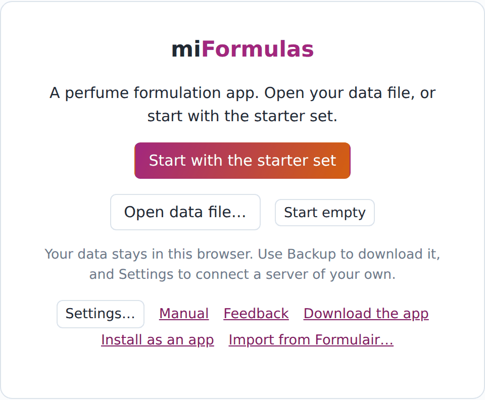

The start screen offers three ways in:

- **Start with the starter set** loads sixteen formulas and nearly two hundred materials to explore. They are marked "starter" so you can tell them from your own; edit or delete them as you like. Whatever you change or add from here on is your work, so make a habit of **Backup** (in the header) before you close the browser: it downloads a copy of the complete data file, named with date and time. Keep those copies together, for instance in `Documents\miFormulas\backups` (Windows) or `Documents/miFormulas/backups` (Mac).
- **Open data file…** opens a miFormulas data file you already have: the Backup you made last time, a file made by the Formulair importer, or a file a colleague sent you. This is how you get your own work back on another computer or in another browser: choose the most recent Backup from your backups folder and carry on where you left off. In Chrome and Edge the app then keeps saving to that file and offers to reopen it next time (section 2).
- **Import from Formulair** takes you to the importer for Formulair users (section 19).

Whichever way in you take, you land on the Welcome page with four tiles (formulas, versions and variations, materials, to order), the recently edited items, and the import and export buttons. Pick a formula or material in the list on the left, or create a new one with **+ New formula** and **+ New material** in the header.

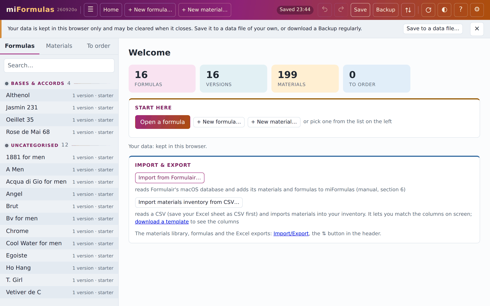

Every change is saved automatically a few seconds after you make it; **Ctrl+Z** undoes it. Deleting a line, a version, a variation, a formula or a material always asks for confirmation.

## 2. Where your data lives: browser, file or server

miFormulas stores everything in one JSON file, `miformulas-data.json`. The app can keep that file in three places, and the top-right of the header always tells you which one is in use ("Saved 14:02 · this browser", "Saved 14:02", "Connected to server").

**In the browser.** On miformulas.com the app keeps the data in the browser's own storage on that computer. This is the quickest way to try things out, and it is fine for everyday use if you download a Backup regularly. Two things to know: every browser has its own storage (Edge and Chrome on the same computer do not see each other's data), and a browser that is set to clear site data when it closes will take your formulas with it. The app asks the browser to keep the storage persistent; as long as the browser has not confirmed that, an amber bar under the header reminds you to make backups.

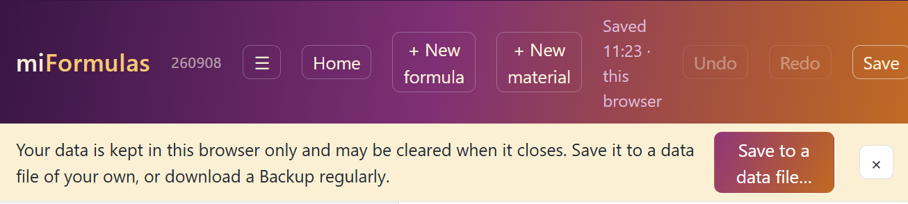

**In a file.** In Chrome or Edge the app can read and write a data file on your disk directly. You see the file, you can copy it, put it in a synced folder, and open it on another computer. The app remembers which file you used; the next time you open it you click **Reopen** and, if the browser asks, allow it to write to the file again. This works with the downloaded app (section 4) and just as well on miformulas.com itself: **Save to a data file…** (in the amber bar or in Settings) moves your work from the browser's storage into a file, **Open data file…** on the start screen switches to an existing file, and the site remembers the file for next time. For a site the browser can also remember the permission itself, in particular once the site is installed as an app: the app then opens straight into your data, and Reopen only appears when the browser wants a fresh click. Combined with "Install as an app" (section 5) that gives you an app with its own icon, your own data file, and updates that arrive by themselves. Firefox cannot write to files: on the site you work in the browser's storage and use Backup to save, and a downloaded copy opened in Firefox is read-mostly (pick the data file once, the app keeps a cached copy, and Backup is the way to save). Safari has no direct file access either, so expect the same there: browser storage and Backup; it has only been tried on the start screen.

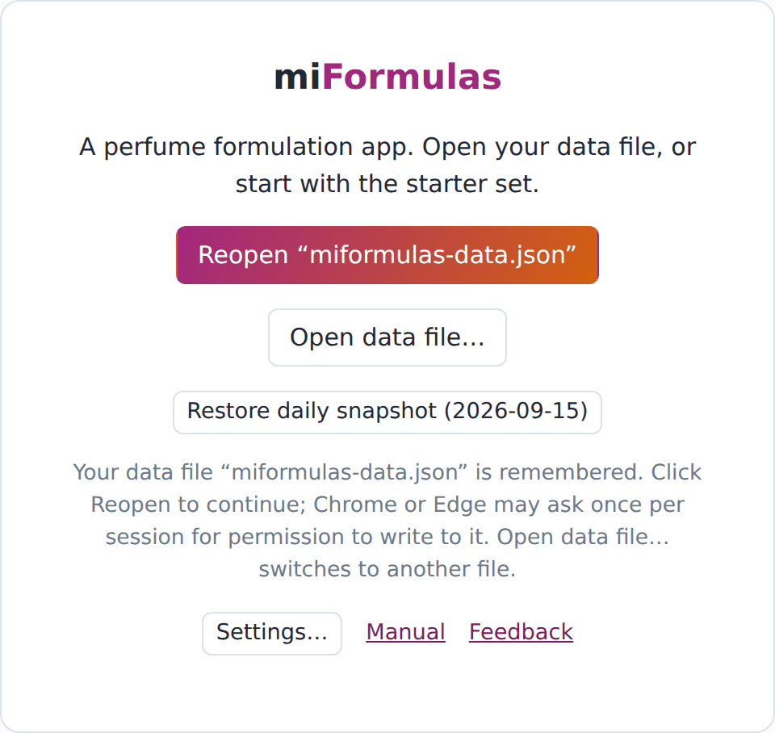

**On a server.** If you have a web server with PHP (a NAS at home, a small hosting account), put the app and the endpoint `server/data.php` on it and every device with the token shares the same data. The server refuses to overwrite changes made from another device in the meantime and keeps a daily snapshot. Section 20 explains the setup.

Whichever mode you use, **Backup** in the header downloads a copy of the data file with a date and time in its name, and **Open data file…** on the start screen opens any such file. Moving between modes is nothing more than a Backup on one side and an Open on the other.

## 3. Privacy: who can see your formulas

Nobody but you. miFormulas runs entirely on your own computer, inside your browser, and your data lives where you put it: in the browser's storage, in a file on your disk, or on a server you own. There is no account, no cloud, no telemetry and no update check, and the author of the app has no way to see your formulas. The app never uploads anything.

This is everything the app does on the network:

- On miformulas.com it loads the starter set from the same site when you click **Start with the starter set**, and on the first visit it checks once whether a `data.php` server sits next to it. The browser also fetches the small app manifest and the icons from the same site, which is what makes "Install as an app" possible.
- The downloaded app makes one kind of request, and only when you click **Start with the starter set**: it fetches the starter set from miformulas.com. That request carries nothing of yours; as with any web page, the server sees that an address asked for a file. Once you have a data file, the app makes no request at all, and you can use it with the network switched off.
- In server mode the app talks only to the server address you entered in Settings.
- **Search** in the order list, the product links and the links in the Help pages open Google, the shop or the site in a new tab, only when you click them.

No analytics, no fonts or scripts loaded from elsewhere, nothing sent in the background. The Formulair importer reads your database in the browser and sends nothing; its database engine (sql.js) is embedded in the file.

miformulas.com is served by GitHub Pages, a static file server: it hands the same HTML file to everyone and receives nothing back. Like any website, its logs record that a page was requested from an address. If even that is more than you want, download the app once and never visit the site again.

The AI prompts in `docs/ai-prompts.md` are the one exception, and you choose it yourself: what you paste or attach in an AI chat goes to that AI provider, under its terms, never to miformulas.

**Check it yourself.** The whole app is one readable file, and the source is public under the GPL at https://github.com/miformulas/miformulas.

1. Open `miFormulas.html` (or `index.html`) in a text editor and search for `fetch(`. There are four in the code: the starter set, the `data.php` probe, and the two calls to your own server (load and save); the fifth hit is this sentence, because the manual is embedded in the app as the Help text. Search for `http` and you find the address of the starter set, the Google search address used by the order list, the licence links, and the links in the embedded manual. Outside this paragraph there is no `<script src=`, no `XMLHttpRequest`, no `sendBeacon` and no `WebSocket`.
2. Or watch the browser: press F12, open the Network tab, and use the app for a while. With a data file, nothing appears at all.
3. Or compare: the file you download from miformulas.com is the file in the repository, byte for byte.

These checks also tell you whether a copy of the app that reached you by another road was changed. Take the app from miformulas.com or from the repository.

## 4. Download and install

There is nothing to install. The whole app is one file, `index.html` on the site and `miFormulas.html` once downloaded, and it runs in any modern browser. Four ways to use it, and for most people the first two together are the right ones:

1. **Use the site, and keep your data in a file of your own.** Open https://miformulas.com and click **Start with the starter set**. Your work is now kept in the browser's own storage; an amber bar under the header says so and offers **Save to a data file…** (Chrome and Edge). Click it: the app explains that it will create your data file, then asks where to keep it. Choose a folder of your own, for instance `Documents\miFormulas`, and keep the name `miformulas-data.json`. From then on the app saves to that file, the bar disappears, and the next time you open the site it continues with that file. Then install the site as an app (section 5) and you have an app with its own icon, your own data file, and updates that arrive by themselves. If you prefer to stay in the browser's storage, use Backup regularly to download a copy of your work.
    
    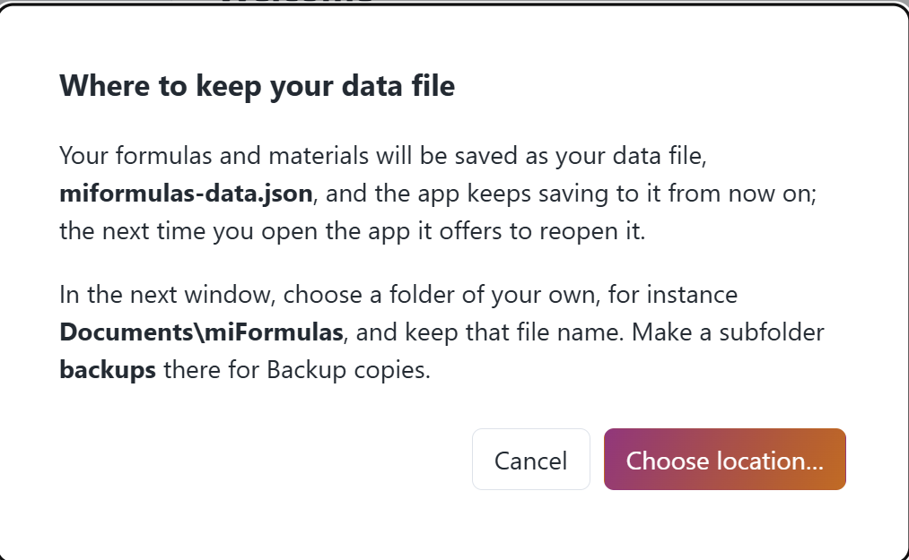
    
    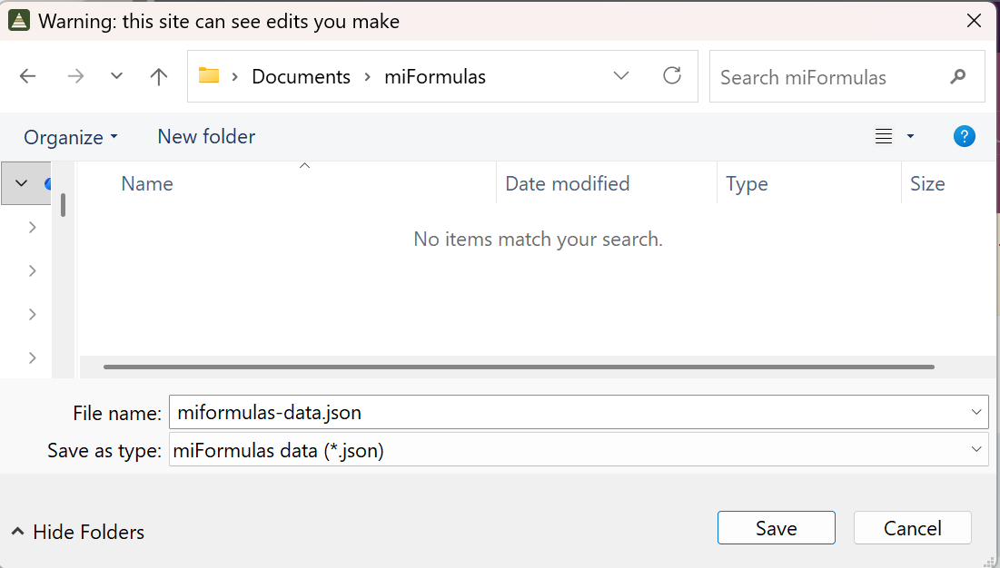

2. **Keep the app itself on your own computer.** On the start screen of miformulas.com click **Download the app**. The file `miFormulas.html` lands in your Downloads folder. Give it a folder of its own, for instance `Documents\miFormulas` (Windows) or `Documents/miFormulas` (Mac), and open it there in Chrome or Edge. The download is meant for Chrome and Edge; in Safari or Firefox the link says so first. The start screen now offers **Start with the starter set**; choose it and the app explains that it will create your data file, then asks where to keep it. Put `miformulas-data.json` in the same folder as the app and keep that name. From then on the app saves to that file automatically, and the next time you open the app it offers **Reopen "miformulas-data.json"**. Make a subfolder `backups` in the same folder for the copies that Backup makes.
    
    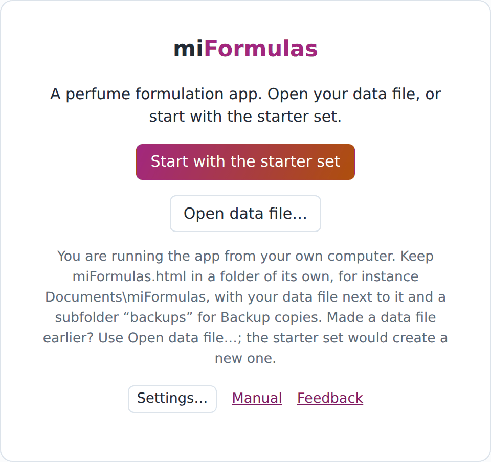
    
    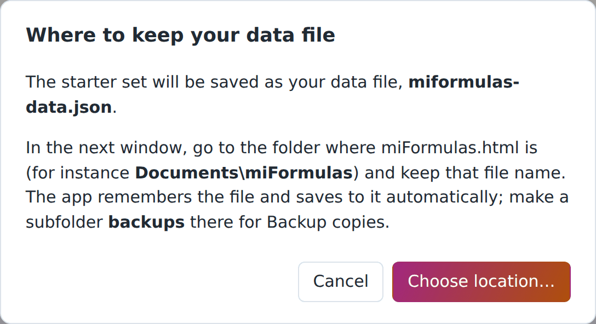

3. **Coming from Formulair?** Open https://miformulas.com/formulair-import.html. It converts your Formulair database in the browser and nothing is uploaded. Section 19 has the steps.
4. **Everything at once.** On the GitHub page https://github.com/miformulas/miformulas click the green **Code** button, then **Download ZIP**. The ZIP holds the app, the Formulair importer, the starter data, the server endpoint and the tools.

Two things about the downloaded app that surprise people:

- The link between the app and your data file is kept by the browser, not by the HTML file. That is why the browser, and not miFormulas, asks once per session for permission to write to the file (for a local file it asks every session; for the site, and certainly for the installed app, it usually remembers), and why a freshly downloaded copy of the app still offers to reopen the data file you used before. Every local HTML file shares this memory, so it does not matter in which folder the app sits.
- If Reopen fails because the data file was moved, renamed or deleted, the app says so, forgets the file and offers the starter set again. If you still have the file, use **Open data file…** to point the app at its new place.

If you already made formulas on miformulas.com before downloading the app, click **Backup** there first and use **Open data file…** in the downloaded app to continue with that file.

Updating is the same as installing: download the new `miFormulas.html` and replace the old one. Your data file is separate and stays untouched.

## 5. Install as an app with its own icon

If you want miFormulas to feel like a program of its own rather than a tab, install it as an app: two minutes, no download, nothing difficult. It then opens in its own window without address bar or tabs, has its own icon in the taskbar, the Start menu or the Dock, and shows up when you switch between programs. Underneath it is the same app in the same browser: the installed app and the site in a normal tab share their data, their remembered data file and their updates.

Browsers only offer this for pages served over https, so it works with miformulas.com and with your own server if that has an https address. A downloaded `miFormulas.html` cannot be installed this way; the last part of this section shows a shortcut that comes close.

**The one-click way (Chrome and Edge, Windows and Mac).** Open https://miformulas.com. When the browser can install the site, the start screen shows the link **Install as an app**, and the same button appears at the top of **Settings** (⚙) once you are working. Click it, and the browser's own install dialog appears with the name and icon; confirm, and the app opens in its own window. Nothing is downloaded and nothing else is installed: the browser does the work, and the installed app shares its data, its remembered data file and its updates with the site in a normal tab. Do this after you have saved your data to a file (section 4): Chrome and Edge remember the permission to write to that file for an installed app, so from then on the app opens straight into your formulas, without Reopen and without questions. In Safari on a Mac the start screen shows **Add to Dock…** instead, which explains the File › Add to Dock route.

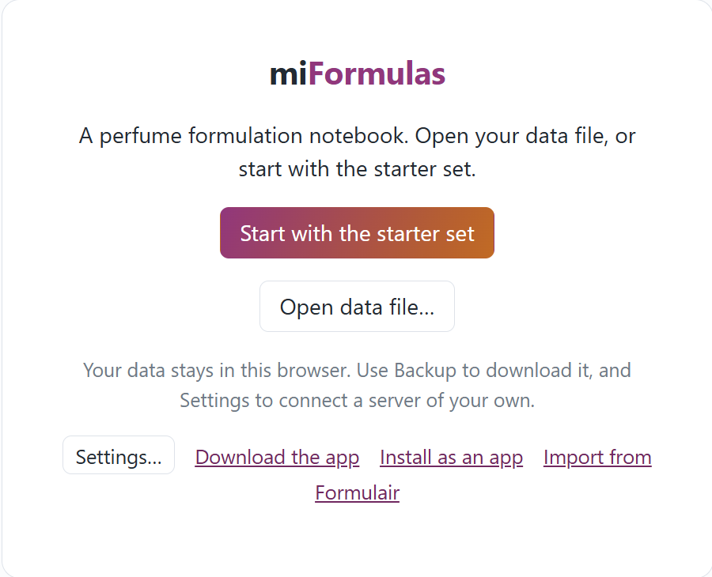

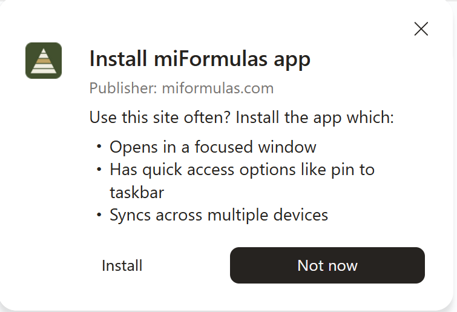

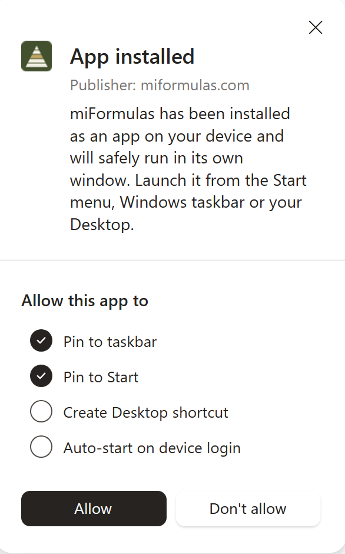

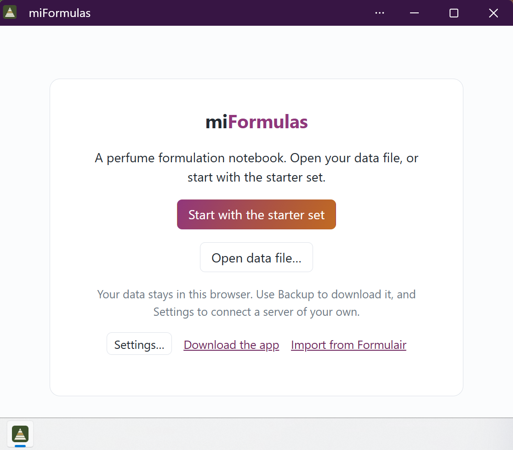

If the link does not appear, your browser did not offer the installation; the menu routes below do the same.

### Windows

**Microsoft Edge.** Open https://miformulas.com. Click the **⋯** menu (Settings and more) in the top-right corner, then **Apps**, then **Install this site as an app**. Edge proposes the name "miFormulas" and the app icon; click **Install**. Edge then offers to pin the app to the taskbar and the Start menu, to create a desktop shortcut and to start it with Windows; tick what you want and confirm. The app is now listed under Apps in the Start menu like any other program. To remove it, open the app, click **⋯** in its title bar and choose **App settings**, then **Uninstall**; or use Windows Settings, Apps, Installed apps.

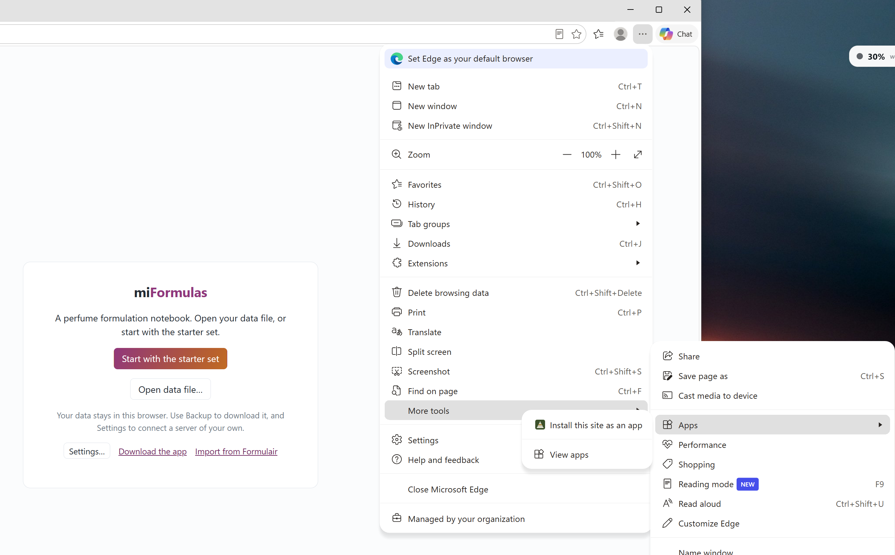

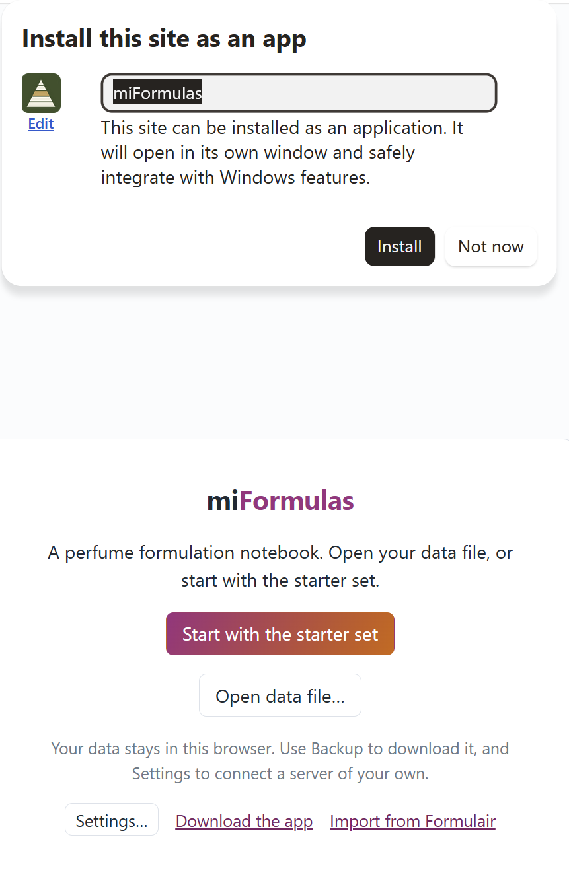

**Google Chrome.** Open https://miformulas.com. Click the **⋮** menu, then **Cast, save and share**, then **Install miFormulas…** (Chrome knows the app by name; for a site without a manifest the item reads "Install page as app…"), and confirm with **Install**. The small install icon at the right end of the address bar does the same. Chrome puts the app in the Start menu; right-click its taskbar icon while it runs to pin it. To remove it, open the app, click **⋮** in its title bar and choose **Uninstall miFormulas…**.

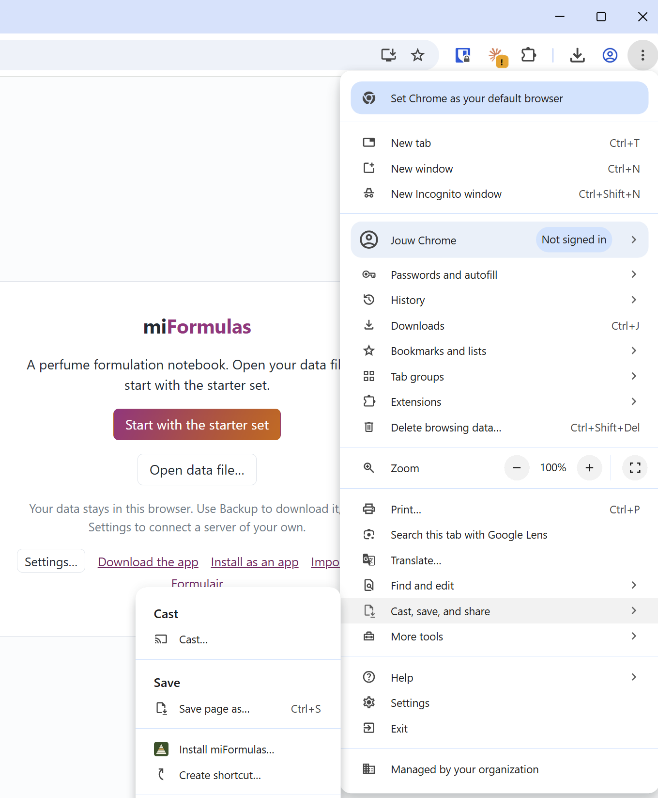

**The downloaded file.** Edge and Chrome do not install local files as apps, but a shortcut can start the browser in app mode with your local copy. Right-click the desktop, choose **New**, **Shortcut**, and as location paste one of these lines, with your own path to the file:

    "C:\Program Files (x86)\Microsoft\Edge\Application\msedge.exe" --app="file:///C:/Users/YourName/Documents/miFormulas/miFormulas.html"

    "C:\Program Files\Google\Chrome\Application\chrome.exe" --app="file:///C:/Users/YourName/Documents/miFormulas/miFormulas.html"

Name the shortcut miFormulas. To give it the miFormulas icon, right-click the shortcut, **Properties**, **Change Icon…**, **Browse…**, and pick `miformulas.ico` from the `icons` folder of the ZIP (or download it from https://miformulas.com/icons/miformulas.ico). The window that opens has no address bar and gets its own miFormulas icon in the taskbar, separate from the browser. The data file and the Reopen behaviour are exactly as in section 4.

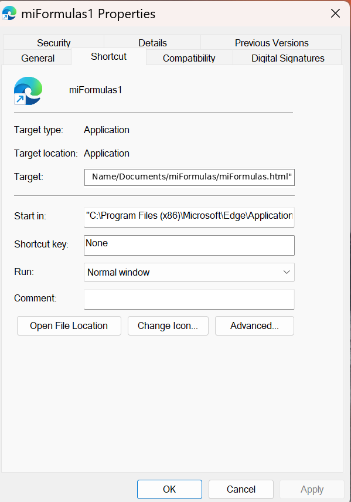

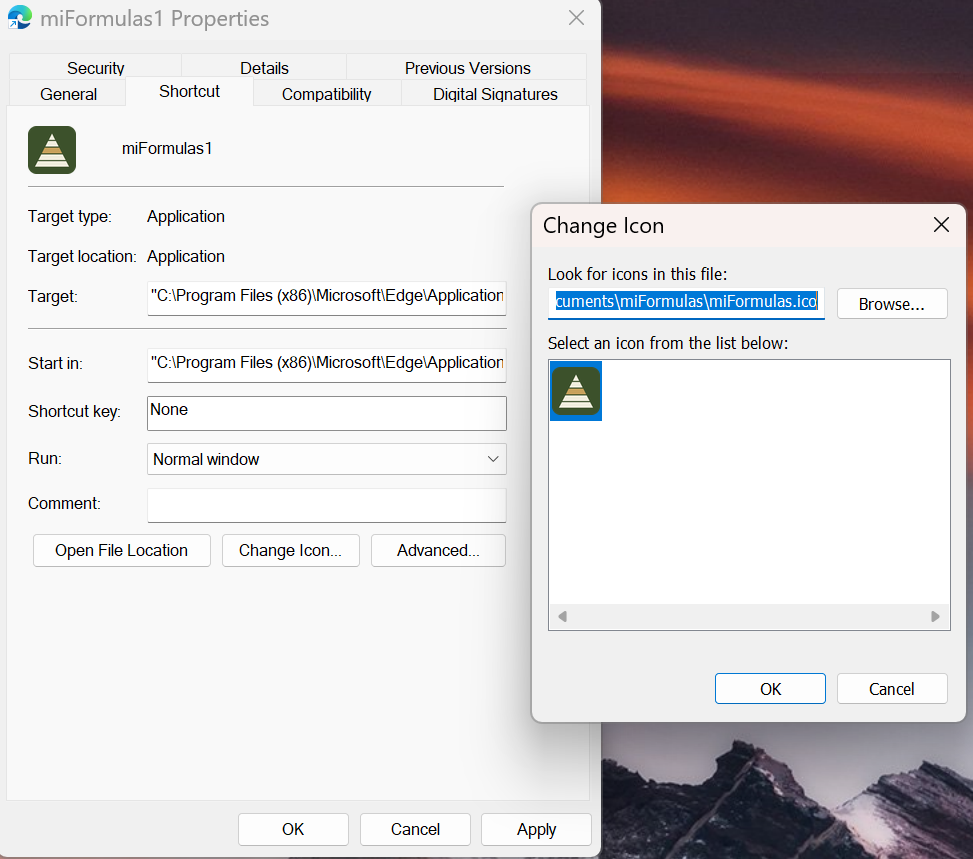

### macOS

**Safari** (macOS Sonoma 14 or later). Open https://miformulas.com, then choose **File**, **Add to Dock**. Keep the name miFormulas and click **Add**. The app appears in the Dock and in the Applications folder of your home folder; open it from either. To remove it, drag it from your home folder's Applications folder to the Bin. Keep in mind that Safari cannot write to a data file. The Dock app keeps your data in its own storage, where it stays between sessions; the system only clears it when you clear website data or leave the app unused for a long time. Backup is your safety net, not your way of working: download one now and then, and use Chrome or Edge if you want a data file you can see and copy. The Dock app's storage is separate from Safari's tabs, so load the starter set, open your data file or fill in Settings in the Dock app itself. One trap: choosing Add to Dock a second time replaces the existing app and wipes its storage; download a Backup first.

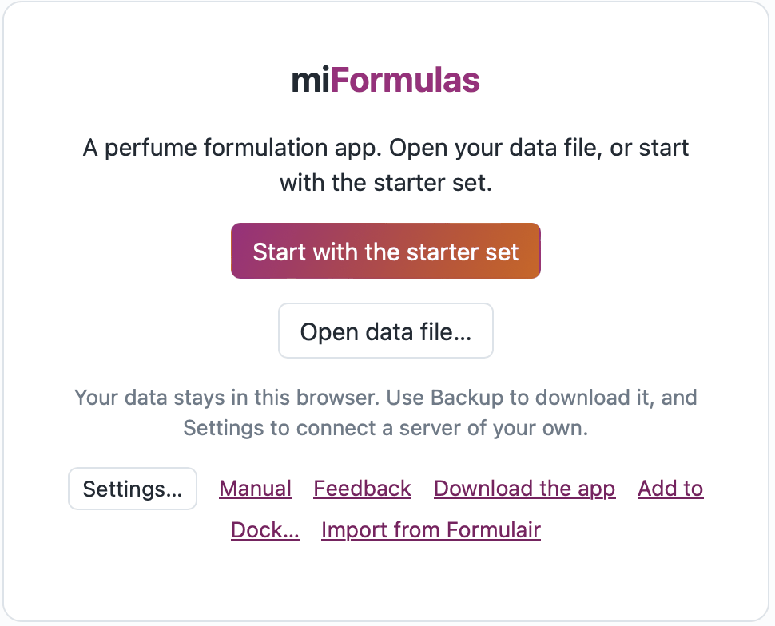

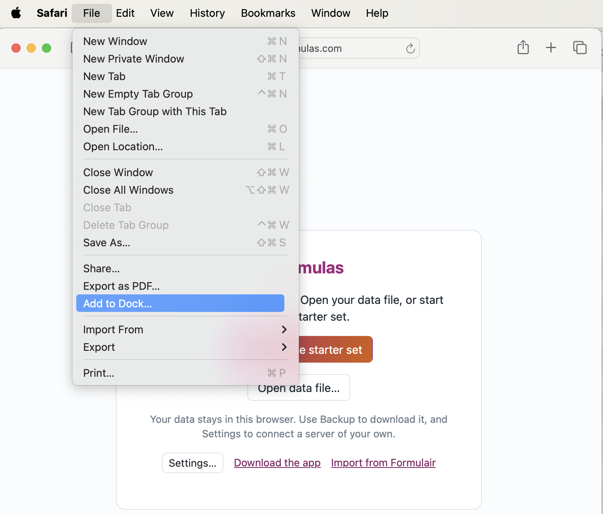

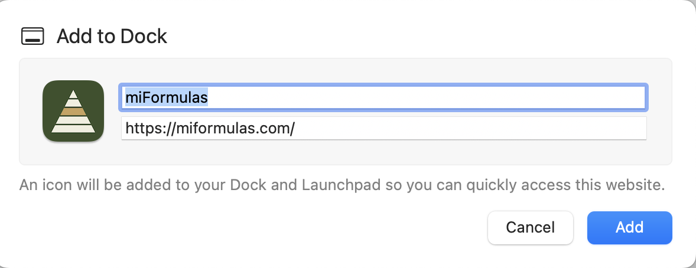

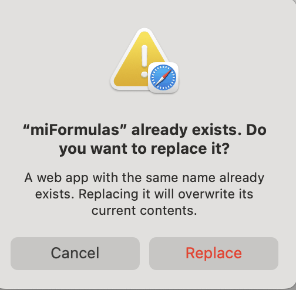

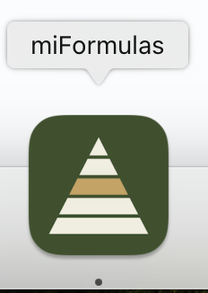

**Chrome or Edge.** The menus are the same as on Windows: in Chrome **⋮**, **Cast, save and share**, **Install miFormulas…**; in Edge **⋯**, **Apps**, **Install this site as an app**. The app lands in the Applications folder (Chrome Apps) and in Launchpad; drag it to the Dock to keep it there. Chrome and Edge on the Mac can write to a data file, so **Open data file…** and Reopen work as on Windows.

**The downloaded file.** Neither Safari nor Chrome installs a local file as an app. What works is a small launcher: open **Automator**, create a new **Application**, add the action **Run Shell Script** and paste, with your own path:

    open -na "Google Chrome" --args --app="file:///Users/yourname/Documents/miFormulas/miFormulas.html"

Save it as miFormulas in your Applications folder and drag it to the Dock. To give it the miFormulas icon, open `miformulas.png` from the `icons` folder (https://miformulas.com/icons/miformulas.png) in Preview, select all and copy, then select the launcher in the Finder, press Cmd+I and paste onto the small icon in the top-left corner of the Info window.

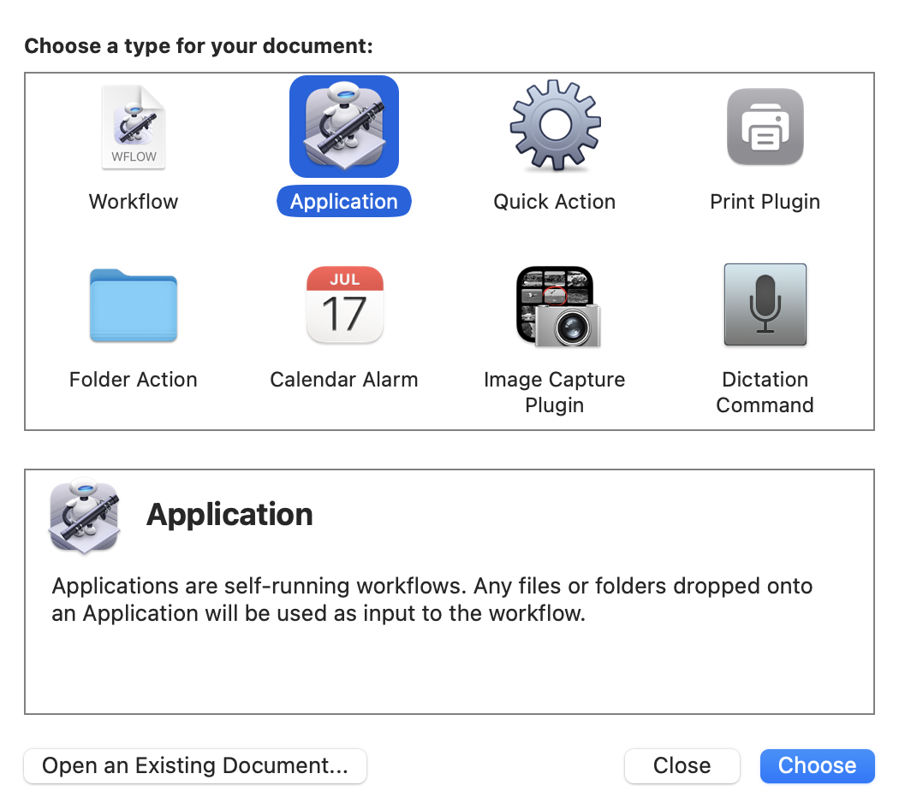

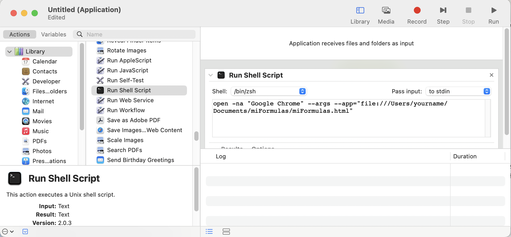

## 6. The screen

The **header** holds, from left to right: the list toggle (☰, also Ctrl+B), **Home**, **+ New formula**, **+ New material**, the save state, **Undo** and **Redo**, **Save** (saving is automatic; this forces it now, also Ctrl+S), **Backup**, the reload button (⟳, use it after an update), the theme button (◐ Auto, ● Dark, ○ Light), **Help** (?, this manual inside the app, without the screenshots) and Settings (⚙).

The **list panel** on the left has three tabs. **Formulas** and **Materials** group their items by category with a coloured dot; the counter after each formula reads "3v · 1var" for three versions and one variation. **To order** is the shopping list. The search box filters the list: formulas by name; materials by name, CAS number and supplier, and from three characters also by the text in their description (those hits are marked with ✎). Typing "starter" lists the starter set.

The **page** on the right shows the selected formula or material, the order list, or the Welcome page.

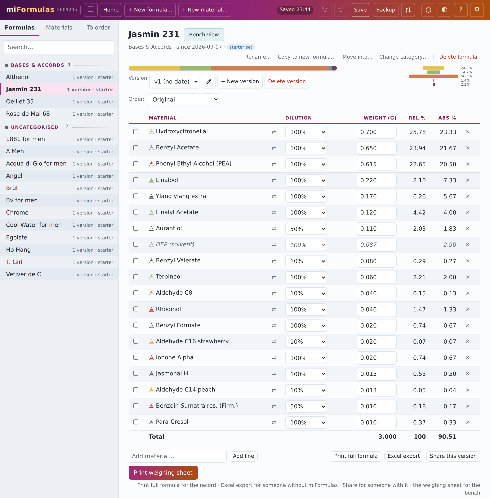

On a phone the list and the page take turns; the app is read-only there unless it can save (server, browser storage or a writable file), so that a tap cannot lose anything.

## 7. Materials

A material is anything you weigh: a raw material, a natural, a base, a solvent, one of your own predilutions. Its page holds the name, CAS number, category (with its own colour, used for the dots and the pyramid), supplier, the amount purchased, cost per gram, IFRA limit, whether it is a solvent, where it is stored (cupboard, fridge, freezer), and its position in the olfactive pyramid (Top, Top-heart, Heart, Heart-base, Base, or ?). Below that come the dilutions, the optional stock ledger, a free description, and the list of every formula the material appears in; click a name there to jump to it.

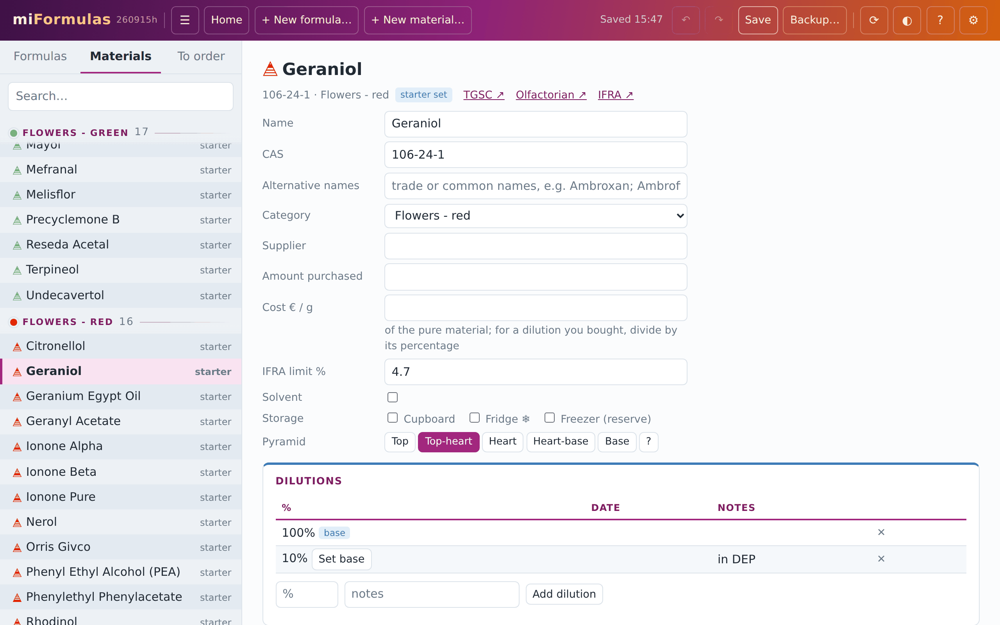

**Dilutions.** A material offers only the dilutions you actually own. If you have Iso E Super at 100 % and at 10 % in ethanol, add both; if you only ever bought a 10 % dilution of a costly absolute, add only 10 %. One of them is the **base** dilution, the concentration that new formula lines start with; any dilution can be the base, and 100 % is not assumed. Deleting a dilution that formulas use is allowed: those lines keep their value, it only disappears from the pick list.

**Solvent.** Tick this for ethanol, DPG, IPM, TEC and the like. Solvent lines carry no aromatic content: they do not count in the relative percentages and they are what the dilution tools exchange against.

**IFRA limit.** Enter the limit in percent of the finished product for Category 4 (fine fragrance), taken from the standards library on ifrafragrance.org. Two special values: **99** means checked, no restriction; empty means not yet checked. The IFRA panel of a formula uses these figures (section 16).

**Storage.** A material stored in the fridge shows a ❄ next to formula lines that use it at its base concentration, also on the printed weighing sheet, so you know which bottles to fetch first.

**To order.** A material you do not have yet, whether you added it from the order list or it came out of an import, carries the label "to order" and a 🛒 in the list until it is delivered.

Materials come from **+ New material** in the header (name, category and base dilution; the rest is filled in on the page), from the order list, from an import, or from the predilution tool. A material can only be deleted when no formula uses it; the page tells you which formulas do.

Filling in CAS numbers, IFRA limits, pyramid levels and descriptions for many materials is tedious; `docs/ai-prompts.md` has a prompt that lets an AI assistant propose them from the **All materials (Excel)** export, for you to check and enter.

What miFormulas does not have is a built-in materials database of the kind some paid apps ship, where a new material arrives with its CAS number, IFRA limit and an odour description already filled in. The names, CAS numbers and IFRA limits of such a database are facts and could be shared freely; the odour descriptions are somebody's writing and cannot. For now the starter set, the Formulair import and the AI prompt above cover most of the ground; a shared materials file that can be imported on its own is an idea for later.

## 8. Formulas, versions and variations

A **formula** is a named recipe in a category. Its history is a row of **versions**: v1, v2, v3 and so on, each with a date, an optional label, notes and its own lines. Only the latest version can be edited; every earlier version is a frozen record of what you did, kept exactly as it was. When you want to change something, create a new version (**+ New version** copies the version you are looking at) and edit that. Deleting a version is possible, deleting the past is not: a new version never rewrites an old one.

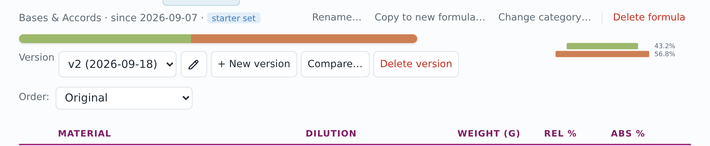

A **variation** is the same recipe in another presentation: the same formula at 20 % instead of 15 %, with the costly material taken from the 10 % dilution instead of the pure one, or made up as a 44 g batch instead of 100 g. A variation carries a label of your choice ("20%", "soap", "44gr") and comes in two kinds:

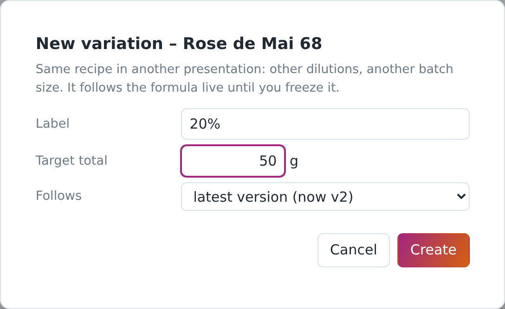

- A **live** variation stores only the deviations (dilution choices, a solvent correction, a target weight) and follows the formula. By default it follows the latest version; you can pin it to a specific version instead. Its lines are recomputed each time you look at it.
- A **frozen** variation is a snapshot with its own lines that never changes. Click **Freeze** on a live variation to make it one; the badge shows which version it was frozen from.

Formulas imported from Formulair are frozen too (section 19): you read them, compare them and copy them, but to work on one you make a new version.

**Move into…** appears on an imported formula that has one version and no variations, which is what every formula from the Formulair import looks like. It makes that formula a new version of another formula, or a frozen variation of one of its versions, and removes it from the list. Lines, notes, date, colour marks and trial log come along, and the import name stays on the version or variation as a reference. Everything is one Undo step. This is how you group the flat Formulair import (section 19).

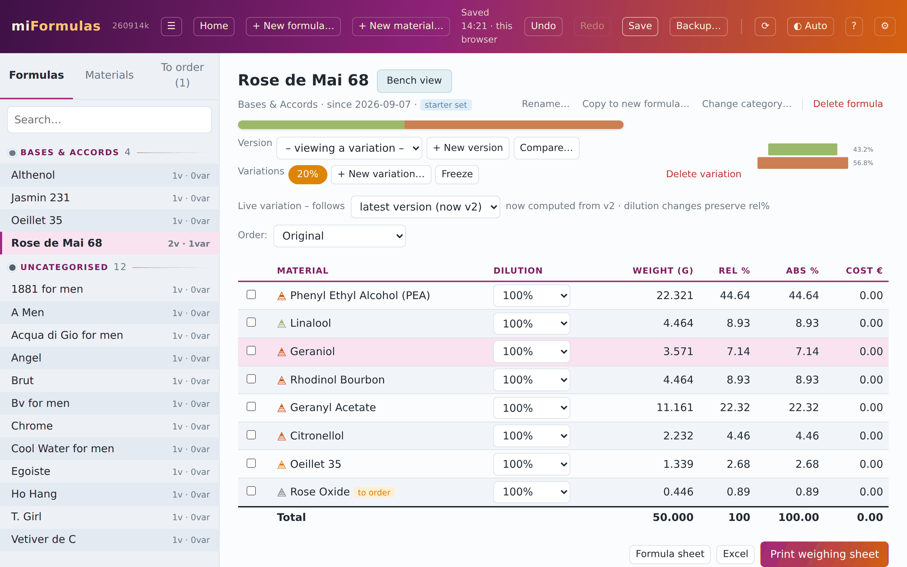

**Copy to new formula** takes the version you are looking at as v1 of a new formula, optionally with the variations. **Rename** and **Change category** do what they say; categories are shared between formulas and get a colour dot.

## 9. Editing a formula

A formula line is a material, a dilution and a weight in grams. To add one, type the material's name in the **Add material…** box under the table (the list suggests as you type) and click **Add line**; the line starts at the material's base dilution with weight 0. Type the weight, choose another dilution from the list if you have one, or pick **custom…** for a percentage you do not stock (the app then warns with ⚠ that this dilution is not in your list, see section 11). Remove a line with ✕.

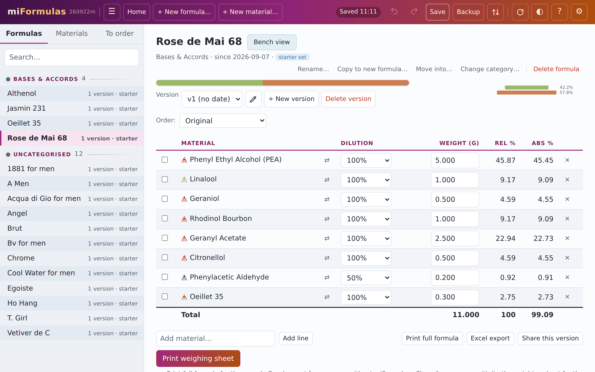

If you add a material that is not in the library, the app offers to create it as a "to order" material: it goes on the order list, and the line is marked until the material is delivered.

The table can be ordered by original entry, by category or by pyramid level (top to base), or by clicking a column heading; the order is also used for the printed sheets. The little icon before each material name shows its pyramid level in the colour of its category.

Below the table sit **Batch scaling** (section 12), **Notes**, the **Trial log** (section 13), the **Categories** panel and the **IFRA check** (section 16), and **Mark as prepared** for the stock ledger (section 17).

## 10. Percentages and the perfumery arithmetic

The table shows two percentages per line, and they follow perfumery practice rather than plain weight shares.

The **content** of a line is its weight corrected for the dilution: 2 g of a 10 % dilution is 0.2 g of material.

**Rel %** is the content of a line divided by the total content of all non-solvent lines. The column adds up to 100; solvent lines show a dash, because they carry no material. This is the composition of the concentrate, independent of how much ethanol is around it.

**Abs %** is the content of a line divided by the total weight of the formula, solvents included. The total of this column is the concentration of the mix: a formula with 15 % abs in total is a 15 % concentrate. Solvent lines show their share of the weight here.

The **cost** of a line is weight × cost per gram × dilution, and the total cost is what the batch cost you in materials.

These rules are what makes the dilution tools work: changing a dilution while preserving rel % keeps the smell the same; the abs % and the total weight then tell you what happened to the strength and the batch size.

## 11. Changing dilutions

Change the dilution of a line by choosing another value in its dilution list. Because a different dilution means a different weight for the same amount of material, the app asks how to proceed:

- **Preserve rel % and exchange solvent.** The weight of the line changes so that its content stays the same, and the difference is taken from or given back to the solvent line (ethanol first, otherwise the first solvent). The total weight and the concentration do not change: this is the same formula, made from another bottle. Not available when there is no solvent line, or when the solvent line does not hold enough to give back.
- **Preserve rel % only.** The weight of the line changes, nothing else; the total weight and the abs % shift.
- **Preserve weight.** The grams stay as they are, so the material content and the rel % change. Use this when the weighing is the fact and the dilution was wrong.

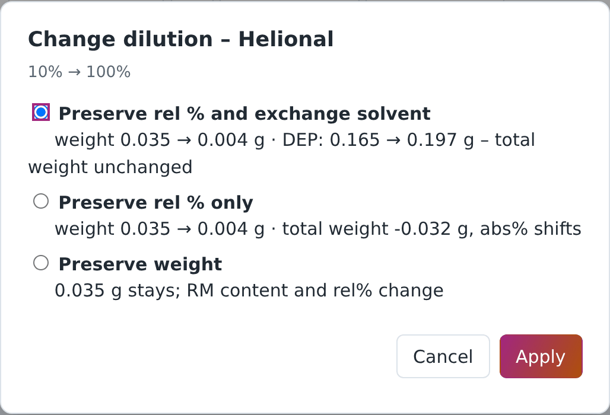

The same question comes up when you replace a material by another one whose dilutions differ.

**Lower** and **Higher** in the tick bar shift all ticked lines to the next lower or higher dilution that the material offers, preserving rel % and exchanging the solvent in one go (so the formula needs a solvent line); lines already at their lowest or highest are skipped and reported.

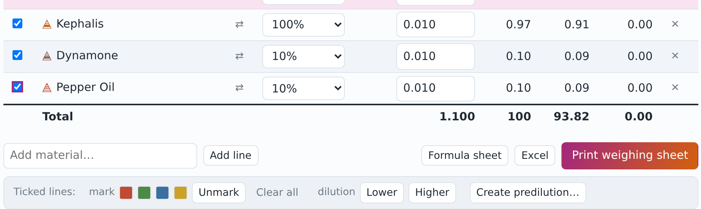

In a live variation the dilution list works the same way but stores an override instead of touching the version, so the variation keeps following the formula.

Lines with a dilution you do not stock are marked ⚠, typically after an import. They compute correctly; when you next make a version, convert them to a dilution you have with "preserve rel % and exchange solvent".

## 12. Batch scaling and predilutions

**Batch scaling** sits under the table. **Apply factor** multiplies every weight (2.5 turns a 40 g trial into 100 g). **Target total** rescales the whole formula to a given weight. **Set EtOH for target abs %** changes only the ethanol line so that the concentrate reaches the percentage you type, adding an ethanol line if there is none; the hint shows the maximum reachable with no ethanol at all. On a live variation, factor and target set the variation's target weight instead. On a read-only entry the target field is still there, because the printed weighing sheet uses it: type 10 g and print a 10 g weighing sheet without touching the formula.

**Create predilution…** bundles ticked lines into a separate, weighable mix. Perfumers do this for the trace materials: instead of weighing 4 mg of five things, you weigh 4 g of each once into a premix and dose 0.4 g of that. The app takes the ticked lines as displayed, lets you name the predilution and choose a batch factor (the preview shows the mix weight, its aromatic strength and the smallest line), then creates three things at once: a frozen predilution formula in the category "Prediluties", a material in the category "Predils" with the aromatic concentration as its dilution and the cost per gram computed, and a new version of your formula in which the ticked lines are replaced by one line of the predilution at the same content. Everything is one Undo step.

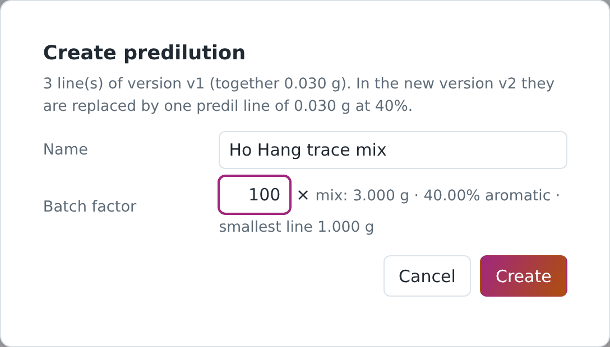

## 13. Colour marks, notes and the trial log

Tick lines with the checkboxes on the left (Shift-click ticks a range) and use the **tick bar**: mark them red, green, blue or yellow, unmark them, or clear every mark. Marks are per version, or per variation for a live variation, and they carry over into new versions and copies. Use them as you like: what changed, what to smell for, what to check.

**Notes** is a free text per version or variation, shown on the formula sheet. The **Trial log** is a dated list of short entries ("day 3, macerated, top too sharp") that also prints on the formula sheet.

## 14. Bench view and printing

**Bench view** (the button next to the formula name) is something you will not find in other formulation apps. It is inspired by the way Ryan Parfums builds his batches in his YouTube videos: start with the core materials, smell, then add the next group of materials step by step. Bench view turns the formula table into that kind of worksheet. The lines start in the **Unsorted** column on the left; drag them into named groups on the right, or tick several lines and choose **Move ticked to…**. The Unsorted column keeps every sort order of the table (original, A to Z, dilution, weight, rel %, category, pyramid), so sorting by category, ticking all the rose materials and moving them into one group takes a few clicks. Five groups are there to start with; **+ Add group** makes as many more as your batch needs, and you can rename, reorder and delete groups as you like. Each group shows its line count, weight, rel % and aromatic strength, so you see what each step adds to the batch. The arrangement is saved with the version or variation. **Print bench sheet** prints the groups with a checkbox per line, in the order you will weigh them.

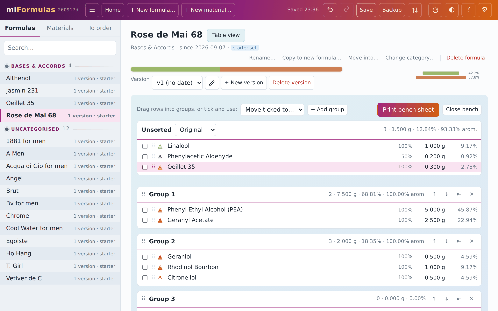

From the table view, three buttons under the lines:

- **Print weighing sheet** prints the lines in the current order with a checkbox, the pyramid icon, the dilution, the grams to weigh and rel %, at the target weight from Batch scaling if you set one. Fridge materials carry the ❄.
- **Formula sheet** prints the complete entry with weights, both percentages, cost, notes and trial log.
- **Excel** downloads the entry as a CSV file with decimal commas, which Excel set to a European locale opens directly.

Printing uses the browser's print dialog; choose "Save as PDF" there for a PDF.

## 15. Comparing versions

**Compare…** (shown as soon as a formula has two entries) puts two versions or variations side by side, aggregated per material: weight and dilutions in A, weight and dilutions in B, rel % in each, and the difference in rel %. Lines only in B are green, lines only in A red, changed lines yellow; the default order puts the largest changes first, and the totals show the weight and the concentration of both. Change A and B with the two lists and close with **Close compare**.

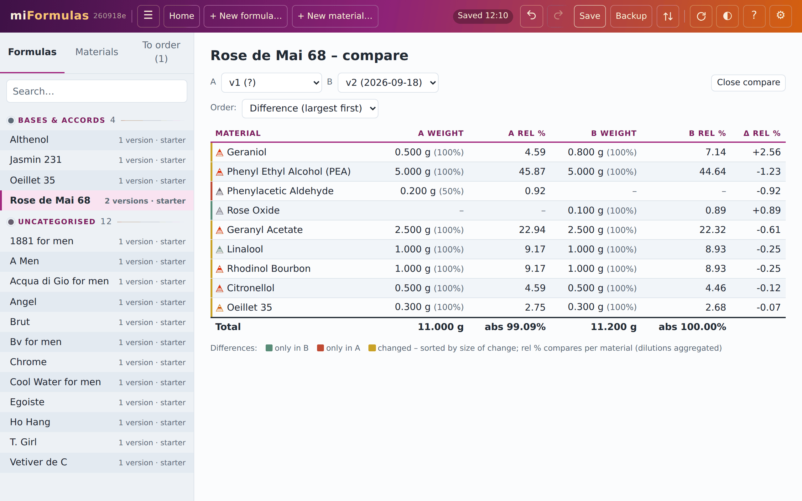

## 16. IFRA check and category panel

The **IFRA check** panel judges the formula against the limits you entered on the materials. It takes each material's rel %, multiplies it by the concentrate dosage (by default the formula's own abs % total, but type another figure to see the same concentrate at 12 % or 20 % in a finished product), and compares the result with the material's limit. The heading says at once whether the formula is within limits or how many materials are over; the table shows the restricted materials with their share in the product, their limit and the percentage of the limit that is used, the worst first. Materials without a limit entered are listed as not yet verified. The check is a help, not an IFRA certificate: it knows only what you entered, and only for the product category you had in mind when you entered it.

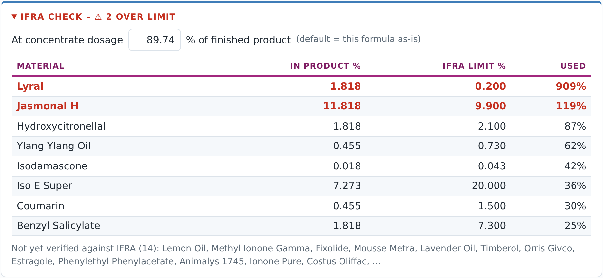

The **Categories** panel shows how the non-solvent content is spread over material categories, dilution-corrected, with a bar per category. The pyramid drawing above the table does the same per pyramid level.

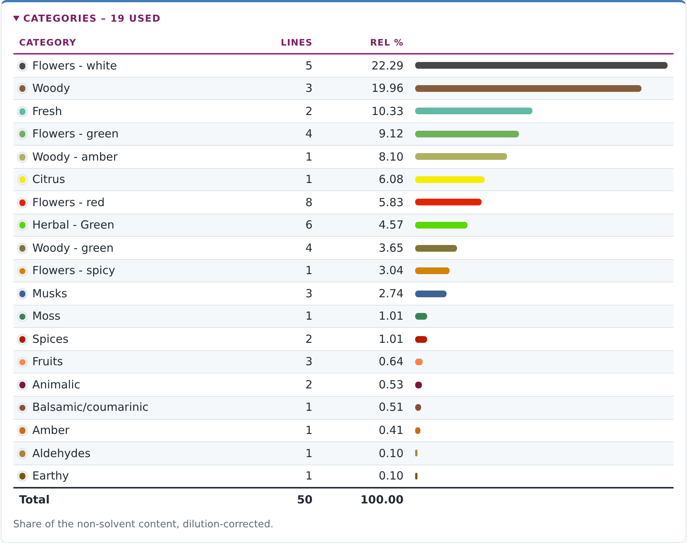

## 17. Stock, orders and deliveries

**Stock** is an optional ledger per material, in grams of the base concentration. Open the Stock panel on a material and set a **stocktake** (what is in the bottle now) to start tracking. From then on purchases add, and two things deduct: **Dilution made** (you made 50 g of a 10 % dilution, so 5 g of base left the bottle) and **Mark as prepared** on a formula, which deducts every base-dilution line of tracked materials, once per version or variation. Purchases in millilitres are converted with the material's density; without a density they are logged but not counted. The ledger follows the base material only, not the dilutions you made from it: a formula line at 10 % does not touch the stock, and an empty bottle of dilution is no problem as long as the base material is still there, because you can make a fresh dilution and log it as **Dilution made**. The estimate is only as good as the entries; the ledger keeps the last events so you can remove a wrong one.

**To order** is the shopping list. Add a material from the list itself (existing or new), with **Add to order list** on a material page, or automatically when a formula or an import mentions a material you do not have. Each entry has a note, an amount and unit, a price and a product link; **Search** opens a Google search limited to the web shops you listed under **Edit shop list** (the list starts empty; add the shops you buy from, one domain per line). **Delivered** closes an entry: it records the amount purchased, the price and the date on the material, computes the cost per gram from price and amount (millilitres via density), adds to the stock ledger if the material is tracked, creates the material if it was new, and removes the "to order" label.

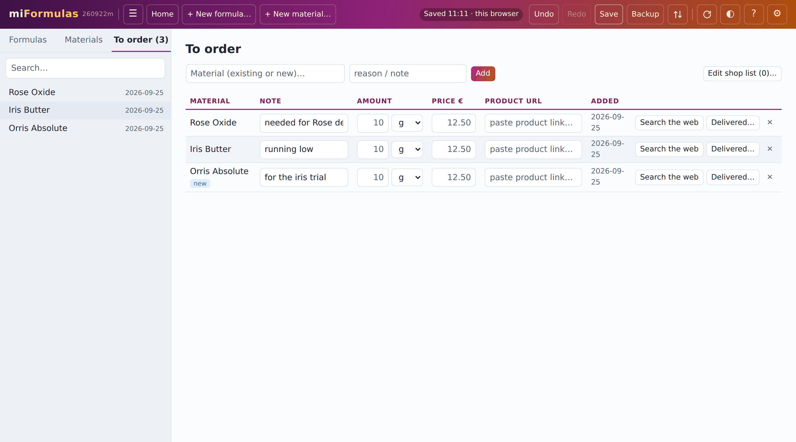

## 18. Import and export

The Welcome page has the import and export buttons. **Import from Formulair…** opens the importer described in section 19.

**Import formula…** reads a miformulas-import JSON file: a formula transcribed from a photo or a document, either as a new formula or as a new version of an existing one. The import page shows every line with its match in your library, the total weight (a round number suggests a complete transcription), which materials are new (they are created as "to order") and which dilutions you do not stock (⚠). Nothing is converted: dilutions and weights come in exactly as written, and you convert in a next version. Confirm, and the formula opens. The file format is the small JSON shown in prompt 1 of `docs/ai-prompts.md`; anything that writes such a file can feed the app.

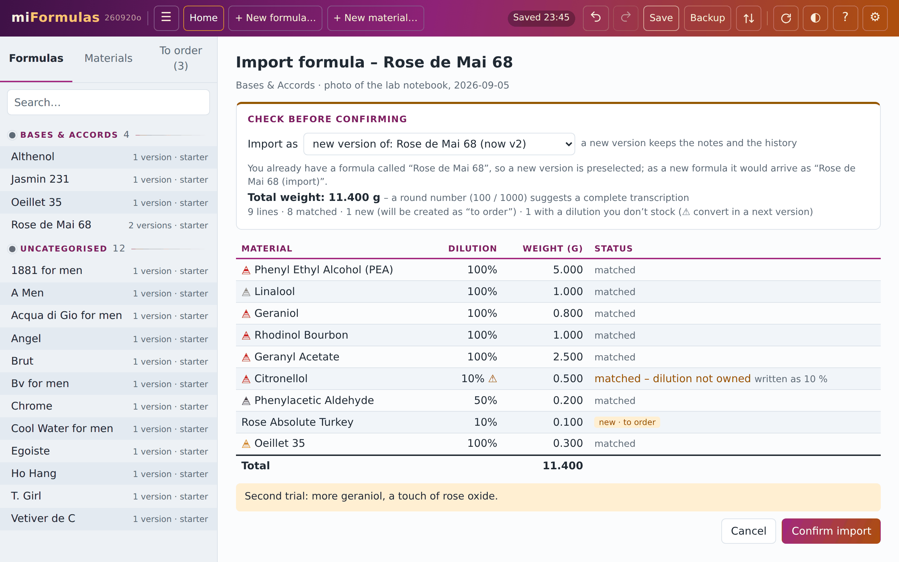

**Turning a photo, PDF or spreadsheet into an import file.** You do not have to write that file by hand. Any AI assistant that can read images and files (ChatGPT, Claude, Gemini, Copilot and others) produces it from a photo of a handwritten sheet, a scan, a PDF or a spreadsheet: paste the ready-made prompt from `docs/ai-prompts.md` (also at https://miformulas.com/docs/ai-prompts.html), attach the photo or file, save the answer as a `.json` file and import it. The prompt tells the AI assistant to transcribe verbatim, to convert nothing, to use the name on the sheet and never to invent one, and to report the total weight and every doubtful line. Attach the **All materials (Excel)** export as well and the assistant uses the exact names of your library, so that every line lands on the right material. The app itself never talks to an AI; the conversion happens in the assistant of your choice, with your files, on your account. That separation is deliberate: a built-in AI would need a paid API key and would send your formulas to a third party, and neither fits an app that keeps everything on your own computer.

**All formulas (Excel)** and **All materials (Excel)** download the whole library as CSV files, one row per formula line with both percentages and cost, and one row per material with all its fields, stock and dilutions. Decimals use a comma, as Excel in Belgium and most of Europe expects; elsewhere open them with Excel's text import and choose the separators.

## 19. Coming from Formulair

A word about Formulair first. I discovered perfumery together with Formulair, Sam Macer's formulation app for the Mac, and for an app built before the AI era it was remarkably complete: materials with their dilutions, formulas with notes and colour marks, costs, IFRA limits, stock. Only two things drove me to build miFormulas: the limits that come with a Mac-only app, and the possibilities that AI assistants now offer around a formulation notebook. The importer below is a bridge and a homage: everything you built in Formulair comes along.

The importer at https://miformulas.com/formulair-import.html reads the Formulair database entirely in your browser and turns it into a miFormulas data file. Nothing leaves your computer.

1. The database is the file `DataModel.sqlite` in Formulair's own folder, which the Finder keeps hidden; the steps below get a complete copy of it onto your Desktop.
2. In Formulair choose **File**, **Close**; Formulair writes its latest changes into the database file and quits by itself (a plain Cmd+Q does not always write them). In the Finder choose **Go**, **Go to Folder…**, paste `~/Library/Containers/co.uk.lux-terra.Formulair/Data/Library/Application Support/Formulair/` and copy `DataModel.sqlite` to the Desktop. A quick check: `DataModel.sqlite` should now carry today's date, and `DataModel.sqlite-wal` next to it should be small (kilobytes, not megabytes). If the -wal file is large, your latest changes are still in it: copy all three files (`DataModel.sqlite`, `-wal` and `-shm`) to a folder `Formulair` on the Desktop and fold them in with one line in Terminal, `sqlite3 ~/Desktop/Formulair/DataModel.sqlite "PRAGMA wal_checkpoint(TRUNCATE);"`, then use the `DataModel.sqlite` from that folder.
    
    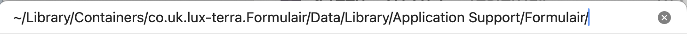
    
    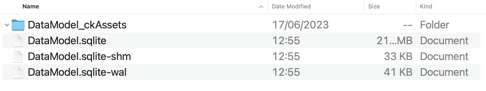

3. Open the importer: click **Import from Formulair** on the start screen or in the Import & export box on the Welcome page, or go to https://miformulas.com/formulair-import.html. Drop `DataModel.sqlite` on it and wait a moment; the file can be large because Formulair keeps a long sync history inside it.
    
    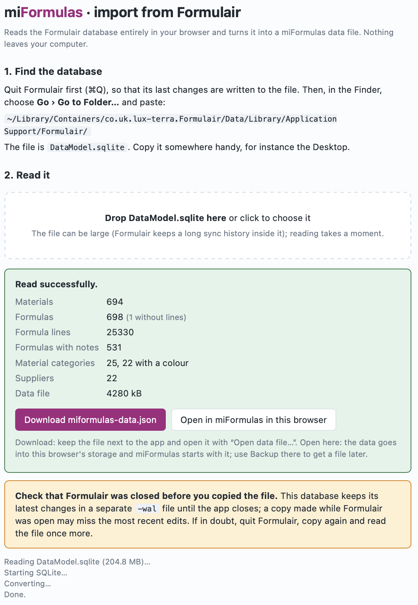

4. Choose **Download miformulas-data.json** to get a data file for the downloaded app or your server, or **Open in miFormulas in this browser** to continue on the site straight away.

Every Formulair formula becomes a miFormulas formula with one frozen version, keeping its notes, date, category and colour marks per line, and every material comes with its dilutions, CAS, supplier, cost, IFRA limit, pyramid level, stock and description; categories keep their colours. Nothing is converted or renamed, and amounts are in grams.

Formulair is flat: "Aura v04" and "Aura v05" are two separate formulas there, and they stay separate here. Grouping them into one formula with versions v4 and v5, and turning "Aura v05 20%" into a variation, is a decision for you, made afterwards in the app with **Move into…** (section 8): open "Aura v05", click Move into…, pick "Aura v04" (the app suggests it when the names differ only in the number at the end) and choose version or variation; then rename "Aura v04" to "Aura". The app never groups by itself, because every perfumer names things differently. For a large library, `docs/ai-prompts.md` has a prompt that lets an AI assistant propose the grouping from the list of names, for you to review before you start.

The same conversion exists as a command-line script, `tools/formulair-naar-json.py`, for those who prefer a terminal.

## 20. Your own server

With a server, every device you own works on the same data, and nobody has to remember to copy files. You need a web server with PHP (8.x) that you can put files on: a Synology or QNAP NAS with its web station, a Raspberry Pi, a small hosting account.

1. Put `index.html` and `server/data.php` in a folder on the server, and create a folder `data` next to them that the web server is allowed to write to. On a NAS this means giving the web server's user (often `http`) read and write rights on that folder; the endpoint tells you in plain words when it cannot write.
2. Open `data.php` in a text editor and replace `change-me-to-a-long-random-token` by a long random string of your own. This token is the password to your data.
3. Put your `miformulas-data.json` in the `data` folder (a Backup from the app, or the file from the Formulair importer), or let the app create it.
4. Open the server's address in a browser. The app detects `data.php` next to itself, asks for the token once, and from then on says "Connected to server". On other devices, open the same address and give the same token; or open Settings and fill in the server endpoint and token by hand, which also works for a `data.php` at another address than the app.

What the endpoint does: it returns the data with an ETag, accepts a save only when the ETag still matches, so that two devices can never overwrite each other (the app then shows a conflict warning: make a Backup, reload and redo the change), and it keeps a snapshot of the previous state in `data/snapshots` on the first save of each day, fourteen days long. Restoring one is copying that file over `miformulas-data.json`.

Reaching the server from outside your home is a matter of your network. A VPN such as Tailscale is the simple and safe way, and it can also give the server an https address, which the "Install as an app" options need. Do not put `data.php` on the open internet without https: the token travels in a header.

To update the app on the server, copy the new `index.html` over the old one; the data stays.

If you would like step-by-step instructions for your own device, `docs/ai-prompts.md` has a prompt that turns this section and `data.php` into a guided setup with an AI assistant.

## 21. Settings, theme and keyboard shortcuts

**Settings** (⚙, also on the start screen) has the number format (browser default, or a fixed locale such as 1.234,56 or 1,234.56; input accepts both comma and point in any case), the server endpoint and its token, and a few buttons that depend on the situation: **Install as an app** when the browser offers it, **Save to a data file…** and **Delete the data kept in this browser…** in browser-storage mode, and **Forget the remembered data file…** when a file is remembered.

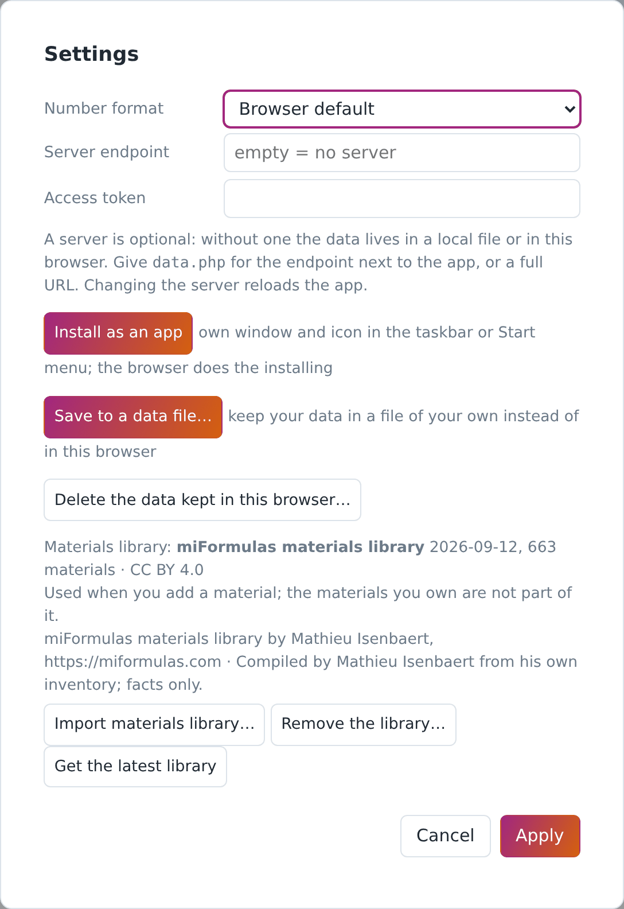

The **theme** button cycles between Auto (follows Windows or macOS), Dark and Light.

Shortcuts: **Ctrl+Z** undo, **Ctrl+Y** or **Ctrl+Shift+Z** redo (up to fifty steps), **Ctrl+S** save now, **Ctrl+B** hide or show the list panel, **Shift-click** on a checkbox ticks a range. On a Mac use Cmd instead of Ctrl.

## 22. Backups and recovery

**Backup** in the header downloads the complete data file, named with date and time (`260907_1402_miformulas-data.json`). Make one before anything you are not sure about, and regularly in browser-storage mode; keep them in a `backups` folder.

The app also keeps one **daily snapshot** in the browser: the state before the first save of the day. In file mode, if the data file is lost, the start screen offers **Restore daily snapshot** with its date; load it and use Backup to write it to a file.

In server mode the server keeps daily snapshots for fourteen days (section 20).

**Open data file…** opens any of these files. **Undo** covers everything you did since the app was opened, deletions included; it does not survive a reload.

## 23. Questions and answers

**The start screen only offers Reopen, and I want the starter set.** The browser still remembers your data file. Click Reopen; if the file exists you continue with it, and if it is gone the starter set comes back. To start a second library next to the first, make a Backup, then delete the browser data for the site (Settings in browser-storage mode) or open another data file.

**I opened the app in another browser and my data is not there.** Browser storage and the remembered file belong to one browser. Use Backup in the first browser and Open data file… in the second, or switch to a file or a server, which every browser on the computer can open.

**Edge asks every time whether the app may edit the file.** That is the browser's rule for local files: one click per session, and the app cannot avoid it. For a site with https the browsers may remember the choice.

**The amber bar says my data may be cleared.** The browser has not promised to keep the site's storage. Click **Save to a data file…** in that bar to move your work into a file of your own (Chrome and Edge), or make backups, or check the browser's setting for clearing site data on exit.

**A line shows ⚠.** Its dilution is not in the material's list. Add that dilution to the material if you do have it, or convert the line to a dilution you have in a next version.

**The IFRA panel says "not yet verified".** Those materials have no limit entered. Look them up on ifrafragrance.org and enter the limit, or 99 if there is none.

**Can I use it on a phone?** Yes, with a server, or with browser storage on the phone. Without a way to save, the app is read-only on a phone.

**Can the author of miFormulas see my formulas?** No. Nothing leaves your computer unless you put it on a server of your own, and the app never contacts miformulas.com except to fetch the starter set when you ask for it. Section 3 lists every network request the app makes and how to verify that yourself in the code.

**Where is the data of an installed app?** In the browser that installed it, in the same place as the site: the app and the tab share their storage and their remembered file.

**I want the site to forget my data file.** Open Settings (⚙): the button "Forget the remembered data file…" makes the app stop offering Reopen. The file itself is not touched.

**Where do I report a problem or suggest something?** On GitHub, at https://github.com/miformulas/miformulas/issues (the **Feedback** link on the start screen goes there; writing there needs a free GitHub account). Say which browser you use and the build number shown next to the name in the header, and what you did; a Backup of a data file that shows the problem helps most, if you are willing to share it.

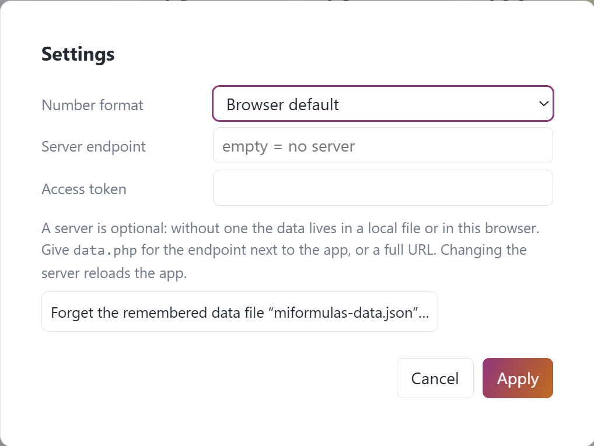

## 24. Licence

miFormulas is free software under the GNU General Public License version 3, with two additional terms under section 7 of the GPL: the name miFormulas is reserved, and every copy must carry the attribution "Based on miFormulas by Mathieu Isenbaert, https://miformulas.com". The full text is in the files LICENSE and NOTICE in the repository at https://github.com/miformulas/miformulas.
